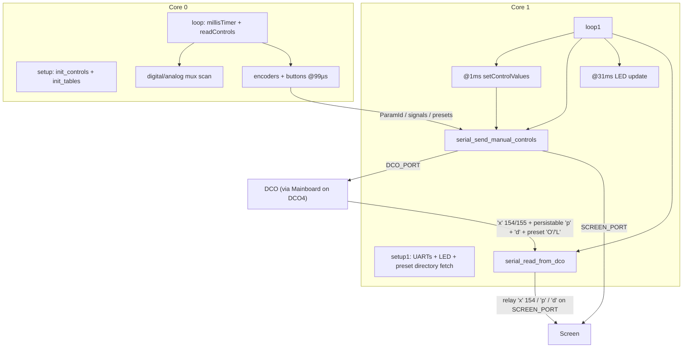

# Input Controller — control pipeline

How front-panel activity becomes DCO / Screen traffic in the **INPUT-CONTROLLER** sketch. The
pipeline is the same code on both instruments; only the hops differ. On DCO3 `DCO_PORT` reaches
the DCO directly. On DCO4 `DCO_PORT` reaches the STM32 Mainboard, which relays the frames on to
the DCO and relays the DCO's replies back, so every frame below makes one extra hop in each
direction. The frame formats are identical on both models, and nothing in this file except the
peer on `DCO_PORT` changes with `INPUT_BOARD_MODEL`.

| Link | DCO3 | DCO4 |
|------|------|------|
| `DCO_PORT` (two-way) | `Serial1`, TX GP0 / RX GP1, peer = DCO | `Serial2`, TX GP4 / RX GP5, peer = Mainboard, which relays to the DCO |
| `SCREEN_PORT` (TX only) | `Serial2`, TX GP4 | `Serial1`, TX GP0 |

---

## Dual-core split

---

## Soft timers

| Core | Flag | Work |
|------|------|------|
| 0 | ~1 ms | Full digital mux + analog sample |
| 0 | other | Digital mux only (no analog) |
| 0 | ~99 µs | `read_encoders` + `read_encoder_buttons` |
| 1 | ~1 ms | Map faders/pots to locals; TX manual blocks |
| 1 | ~31 ms | LED mux update |
| 1 | always | Inbound parser on `DCO_PORT` |

---

## Outbound: `DCO_PORT`

Peer is the DCO on DCO3 (its own `Serial2`, RX GP21) and the Mainboard on DCO4, in both cases at
2.5 Mbaud. Input is the serial hub for the Screen, which has no link of its own, so everything the
Screen sees arrives through `SCREEN_PORT`.

| When | Cmd | Content |
|------|-----|---------|
| Manual ADSR1 | `'a'` | 8 bytes A/D/S/R **LE**; A/D/R **exp-mapped** via `linToExpLookup`, S linear |
| Manual ADSR2 | `'b'` | Same for ADSR2 (only while `ADSR3Enabled` is false) |
| Manual ADSR3 | `'c'` | Exp-mapped ADSR3 (sent only when `ADSR3Enabled`) |
| Manual VCF pots | `'d'` | CUTOFF, RESONANCE, ADSR2toVCF, LFO2toVCF LE |
| Manual VCA pot | `'p'` 222 | `PARAM_ADSR1_TO_VCA` i16 LE |
| Manual PW pot | `'p'` 210 | `PARAM_PW_VALUE` i16 LE |
| Encoder/button ParamId | `'p'` | Via `serial_send_param_change` / `_byte` (byte params zero-extended to i16) |
| Preset save | `'q'` + `'p'` 170 | 16-char name (`serial_send_preset_name_to_mainboard`) then `PARAM_PRESET_SAVE` = slot, from `preset_save_to_board` |
| Preset load | `'p'` 171 | `PARAM_PRESET_LOAD` = slot, from `preset_load_from_board` |
| Preset directory request | `'N'` | `request_preset_directory()`, 1 pad byte (0-byte frames can't dispatch) |

`serial_send_manual_controls(presetLoading)` gates each block on its `*ControlManual` flag. The
`presetLoading` override that forced all blocks out has no live caller any more: the only call is
`serial_send_manual_controls(false)` from `loop1()`, because a recall is now applied by the DCO and
mirrored back rather than re-sent from the panel.

The legacy flag-driven big-endian TX path is gone. `sendSerial()` is an empty stub, and the
`serial_send_*Flag` / `serialSendADSR3*` globals that drove it were deleted from `Serial.h`.

---

## Outbound: `SCREEN_PORT` (TX only)

| Cmd | Role |
|-----|------|
| `'a'` / `'b'` | ADSR1/2 **raw** fader values LE (UI bars) |
| `'q'` | Preset scroll: number + **16**-char name (17 B, no finish) |
| `'s'` | UI mode signals (load/save flow — list in `Serial.h`) |
| `'c'` | Save char-position select (unrelated to the DCO's `'c'` ADSR3 block) |
| `'y'` | `[id][u8]` nav/cal to screen |
| `'p'` | Slim `'p'` when `sendToAll`, and the relayed inbound persistable mirror |
| `'w'` | Screen-only 8-bit UI `[id][u8]` when `sendToAll` |
| `'x'` | Slim gap 154 relayed from the DCO (`serial_forward_param32_to_screen`) |
| `'d'` | Filter block relayed from the DCO (`input_handle_filter_block_from_dco`). The Screen does not register `'d'` in its own command table yet, so this frame is currently ignored at the far end |

---

## Inbound

`serial_read_from_dco()` pumps the parser on `DCO_PORT` every `loop1` iteration.
`dcoLinkCommands[]` registers five inbound commands (`'p'`, `'x'`, `'d'`, `'O'`, `'L'`), and every
frame below arrives from the DCO on DCO3 and from the Mainboard, relaying the DCO, on DCO4:

| Frame | Handling |
|-------|----------|
| `'x'` `PARAM_GAP_FROM_DCO` (154) | Forwarded verbatim as slim `'x'` (5 B `[id][u32 LE]`) to the Screen (`serial_forward_param32_to_screen`). Nothing is stored locally |
| `'x'` `PARAM_MANUAL_CALIBRATION_OFFSET_FROM_DCO` (155) | Low 16 bits unpacked as `[oscIndex:8 \| offset:8]` into `manualCalibrationInitAmpCompOffset[oscIndex]` after a `NUM_OSCILLATORS` bounds check; echoed to the Screen as `PARAM_MANUAL_CALIBRATION_OFFSET` when manual calibration is currently showing that oscillator, resolved through `INPUT_CAL_STAGE_TO_OSC(manualCalibrationStage)` |
| `'p'` persistable ParamIds | Write Input's in-RAM locals only (`input_handle_param16_from_dco`; there is no LittleFS on this board). ADSR3→PWM (46) stores **wire − 512**, `PARAM_ADSR3_TO_OSC_SELECT` is clamped to `INPUT_ADSR3_TO_OSC_SELECT_MAX`, and mod-slot IDs are demultiplexed into `modSlotSource` / `modSlotDest` / `modSlotDepth`. Never re-transmitted to the DCO; the same wire `'p'` is forwarded to the Screen. This is also how a preset recall's mirrored params reach Input |
| `'d'` filter block | `input_handle_filter_block_from_dco` decodes CUTOFF, RESONANCE, ADSR2toVCF and LFO2toVCF into the locals, then forwards the payload as `'d'` to the Screen. It fires after a preset recall, and on DCO4 also after a Mainboard-side filter change |
| `'O'` preset directory entry | `[slot:u8][name:16]` copied into `presetDir[slot]` (`input_handle_preset_dir_entry`), in response to `'N'` |
| `'L'` preset loaded | `[slot:u8]` updates `currentPreset` / `presetSelectVal` / `presetName` from the cache and pushes a Screen scroll plus signal 1 (`input_handle_preset_loaded`); it fires after **every** DCO-side load, whether from boot recall, MIDI program change, USB / `dco_control`, or Input itself |

The `'d'` handler is new on DCO3. Before it existed an inbound filter block had no registered
handler and was dropped, so the panel's own CUTOFF, RESONANCE, ADSR2toVCF and LFO2toVCF values did
not follow a preset recall and the relay to the Screen did not exist at all. The relay is in place
now, but the Screen's command table still has no `'d'` entry, so the Screen ignores the frame until
one is added there.

The Screen has no link to the DCO, so every gap update and USB/MIDI persistable `'p'` reaches it
through this relay. `SCREEN_PORT` is TX-only, because the Screen never transmits. See
[`SYSTEM_OVERVIEW.md`](SYSTEM_OVERVIEW.md) and the DCO's canonical overview.

There is no live inbound apply router on this board (`params.ino` is commented out and
`param_router.h` is unused). Input is primarily a **sender**, plus the RAM mirror described above.

---

## Presets

The DCO's 256-slot LittleFS store (`pb00..pb63`, 4 records each) is the single source of truth for
both instruments; the DCO4 tree's own LittleFS preset bank has been removed. Input keeps a RAM-only
256-name directory cache (`presetDir[256][16]`, synced with `'N'` and `'O'`), and
`preset_save_to_board` / `preset_load_from_board` only ask the DCO to save or load a slot. The DCO
applies the record itself and mirrors persistable params and blocks back over the existing `'p'` and
`'a'`–`'d'` path, so Input never unpacks a record locally. On DCO4 the request, the mirror and the
`'O'`/`'L'` notices all travel through the Mainboard. Full flow: [`PRESETS.md`](PRESETS.md).

---

## Manual vs encoder modes

Buttons toggle `faderRow*ControlManual`, `VCFPotsControlManual`, etc. When manual is off, those
continuous controls are not streamed from the pots; encoder and button ParamIds still send.
