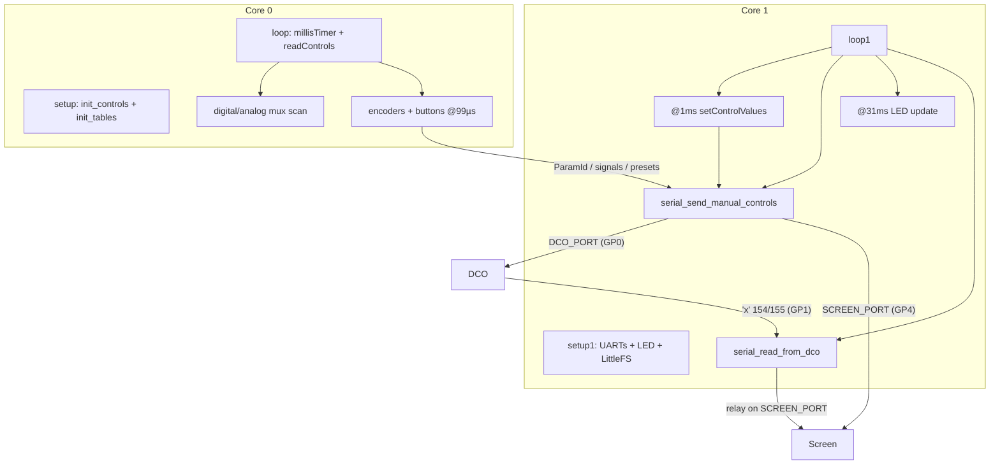

# Input Controller — control pipeline

How front-panel activity becomes DCO / Screen traffic on **DCO4_Input_Controller**.

---

## Dual-core split

---

## Soft timers

| Core | Flag | Work |
|------|------|------|
| 0 | ~1 ms | Full digital mux + analog sample |
| 0 | other | Digital mux only (no analog) |
| 0 | ~99 µs | `read_encoders` + `read_encoder_buttons` |
| 1 | ~1 ms | Map faders/pots → locals; TX manual blocks |
| 1 | ~5 ms | May set ADSR3 send flag |
| 1 | ~31 µs/ms | LED mux update |
| 1 | always | Inbound DCO `'x'` parser on `DCO_PORT` |

---

## Outbound: DCO (`DCO_PORT` = `Serial1`, TX GP0 → DCO GP21)

Peer is the **DCO** board (its own `Serial2`, RX GP21) at 2.5 Mbaud. This board is the serial hub, so the Screen is reached only through `SCREEN_PORT`. The old STM32 Mainboard is archived.

| When | Cmd | Content |
|------|-----|---------|
| Manual ADSR1 / preset load | `'a'` | 8 bytes A/D/S/R **LE** (**exp-mapped** via `linToExpLookup`) |
| Manual ADSR2 | `'b'` | Same for ADSR2 |
| Manual ADSR3 | `'c'` | Exp-mapped ADSR3 (DCO only) |
| Manual VCF pots | `'d'` | CUTOFF, RESONANCE, ADSR2toVCF, LFO2toVCF LE |
| Manual VCA pot | `'p'` 222 | `PARAM_ADSR1_TO_VCA` i16 LE |
| Manual PW pot | `'p'` 210 | `PARAM_PW_VALUE` i16 LE |
| Encoder/button ParamId | `'p'` | Via `serial_send_param_change` / `_byte` (byte params zero-extended to i16) |
| Preset name (8 chars) | `'q'` | `serial_send_preset_name_to_mainboard` (**dead**) |

`serial_send_manual_controls(presetLoading)` gates blocks on the `*ControlManual` flags (or forces all when loading a preset).

---

## Outbound: Screen (`SCREEN_PORT` = `Serial2`, TX GP4 → Screen GP13)

| Cmd | Role |
|-----|------|
| `'a'` / `'b'` | ADSR1/2 **raw** fader values LE (UI bars) |
| `'q'` | Preset scroll: number + **16**-char name (17 B, no finish) |
| `'s'` | UI mode signals (load/save flow — list in `Serial.h`) |
| `'c'` | Save char-position select |
| `'y'` | `[id][u8]` nav/cal to screen |
| `'p'` | Slim `'p'` when `sendToAll` |
| `'w'` | Screen-only 8-bit UI `[id][u8]` when `sendToAll` |
| `'x'` | Slim gap 154 relayed from the DCO (`serial_forward_param32_to_screen`) |

---

## Inbound

Live path: `serial_read_from_dco()` on **`DCO_PORT`** (RX GP1 ← DCO GP20) pumps the parser for DCO `'x'` PARAM_32 frames:

| ParamId | Handling |
|---------|----------|
| `PARAM_GAP_FROM_DCO` (154) | Forwarded as slim `'x'` (5 B `[id][u32 LE]`) to the Screen on `SCREEN_PORT` (`serial_forward_param32_to_screen`) |
| `PARAM_MANUAL_CALIBRATION_OFFSET_FROM_DCO` (155) | Low 16 bits unpacked as `[oscIndex:8 \| offset:8]` into `manualCalibrationInitAmpCompOffset[oscIndex]`; echoed to the Screen as `PARAM_MANUAL_CALIBRATION_OFFSET` when manual calibration is showing that oscillator |

The Screen has no direct DCO link, so every gap update reaches it through this relay. `SCREEN_PORT` is TX-only (the Screen never transmits). See [`SYSTEM_OVERVIEW.md`](SYSTEM_OVERVIEW.md) / DCO canonical note.

No live `update_parameters` / `paramTable` on this board (`params.ino` commented). Input is primarily a **sender**.

---

## Presets

LittleFS bank → RAM → `loadPreset` / `writePreset` unpack ParamIds and re-TX (including `'a'`–`'d'` + `'p'` 210/222 via `serial_send_manual_controls(true)`). Full flow and slot layout: [`PRESETS.md`](PRESETS.md).

---

## Manual vs encoder modes

Buttons toggle `faderRow*ControlManual`, `VCFPotsControlManual`, etc. When manual is off, those continuous controls are not streamed from pots; encoder/button ParamIds still send.
