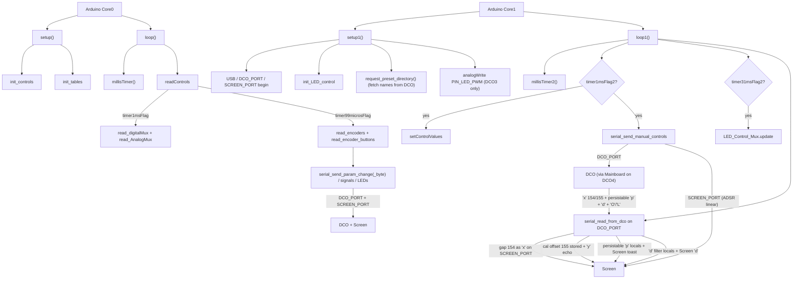

# INPUT-CONTROLLER File Index

Purpose of **every file**, and for each source function: **what it does**, **who calls it**, and **when**.

One sketch serves both instruments. The `DCO3-MONOSYNTH/INPUT-CONTROLLER` and `DCO4-REBORN/INPUT-CONTROLLER` trees are byte-identical, including [`board_model.h`](#board_modelh): the instrument comes from the superproject through the [`project_config.h`](#project_configh) symlink, and every model difference described below is derived from it.

- Deep narrative: [`REFERENCE_AI.md`](REFERENCE_AI.md)
- Panel / pin map: [`PANEL_AND_PINS.md`](PANEL_AND_PINS.md)
- Preset browse/save/load (DCO owns storage): [`PRESETS.md`](PRESETS.md)
- Control scan → serial path: [`CONTROL_PIPELINE.md`](CONTROL_PIPELINE.md)
- Serial / ParamId how-to: [`README_serial_and_params.md`](README_serial_and_params.md)

> `params_def.h`, `param_router.h`, `serial_input_protocol.h`,
> `serial_param_protocol.h`, `serial_frame.h` and `serial_parser.h` are no longer
> files in this folder. They come from the shared
> [`DCO-PROTOCOL`](../../DCO-PROTOCOL/README.md) library, symlinked in as
> `_build_libs/DCO-PROTOCOL`. Their entries below still describe the code this
> board compiles; edit them in the library, once, for every board.
- Three-board topology: [`SYSTEM_OVERVIEW.md`](SYSTEM_OVERVIEW.md) (stub → DCO4_DCO canonical)
- Repo entry / doc index: [`../README.md`](../README.md)

Headers with no bodies are marked **no function definitions**.  
**Dead** = no live callers. **Unreachable** = call site exists but cannot run as currently gated. **`#ifdef` gated** = compiled only when the flag is set. **commented-out** = body fully commented (not compiled).

MCU: **RP2040** (dual Arduino cores). Panel brain: mux faders/pots, encoders, buttons, 74HC595 LEDs, a RAM-only 256-slot preset name cache (no LittleFS on either model — the DCO's LittleFS is the preset store of record); `DCO_PORT` is the two-way panel link, `SCREEN_PORT` is the TX-only Screen link. Which UART is which is a per-PCB fact taken from `board_model.h`:

| Model | `DCO_PORT` | `SCREEN_PORT` | Peer on `DCO_PORT` |
|-------|------------|---------------|--------------------|
| DCO3 | `Serial1` (RX GP1 / TX GP0) | `Serial2` (RX GP5 / TX GP4) | the DCO itself |
| DCO4 | `Serial2` (RX GP5 / TX GP4) | `Serial1` (RX GP1 / TX GP0) | the STM32 Mainboard, which relays on to the DCO |

Never infer the peer from the port number; always read and write the aliases. Both links run at 2 500 000 baud, USB debug at 2 000 000.

---

## Call-flow overview

| Context tag | Meaning |
|-------------|---------|
| Framework | Arduino invokes `setup` / `loop` / `setup1` / `loop1` |
| Boot Core0 | Inside `setup()` once |
| Boot Core1 | Inside `setup1()` once |
| Every `loop` / `loop1` | Realtime forever loops |
| Soft timer Core0 | Gated by `millisTimer()` flags (`timer1msFlag`, `timer99microsFlag`, `timer200msFlag`, …) |
| Soft timer Core1 | Gated by `millisTimer2()` flags (`timer1msFlag2`, `timer31msFlag2`, …) |
| `DCO_PORT` (DCO on DCO3, Mainboard on DCO4) | TX slim LE `'a'`–`'d'` / `'p'` / `'q'` / `'N'`; RX `'x'` (gap 154, cal offset 155), persistable `'p'` mirror, `'d'` filter block, `'O'`/`'L'` preset frames |
| `SCREEN_PORT` (Screen) | TX UI signals / params / linear ADSR + relayed `'x'` gap 154 and `'d'` filter block; no RX (the Screen never transmits) |
| Param TX | Live path is `serial_send_param_change` / `_byte` from encoders/buttons/presets |
| Manual controls | `*ControlManual` flags → `setControlValues` + `serial_send_manual_controls` |
| `#ifdef` | `ENABLE_SERIAL` (**off** by default), `ENABLE_DCO_LINK`, `ENABLE_SCREEN_LINK` |
| Model gate | `INPUT_IS_DCO3` / `INPUT_IS_DCO4` / `INPUT_HAS_LED_PWM` / `INPUT_HAS_OSC3_PANEL` from `board_model.h` |

---

## 1. Entry / build / globals

### `INPUT-CONTROLLER.ino`

Main sketch (renamed from `DCO4_Input_Controller.ino` so the sketch name matches the folder in both projects; the old `DCO4_Input_Controller -> .` self-symlink is gone): dual-core `setup`/`loop`/`setup1`/`loop1`, voice/param globals, UART bring-up on Core1, panel scan on Core0. It includes `board_model.h` before `params.h` and `Serial.h`, because those size their arrays and pick their ports from it.

**Functions**
- `setup()` — `init_controls()` + `init_tables()`.
  - **Called from:** Arduino framework (Core 0).
  - **When:** Boot Core0 once.
- `setup1()` — USB debug Serial under `ENABLE_SERIAL`; `DCO_PORT` and `SCREEN_PORT` on the `INPUT_DCO_*_PIN` / `INPUT_SCREEN_*_PIN` pins from `board_model.h` (FIFO 512, IRQ) @ 2 500 000; `init_dco_link_parser`; `init_LED_control`; `request_preset_directory()`; `analogWriteFreq` + `analogWrite(PIN_LED_PWM, 245)` under `#if INPUT_HAS_LED_PWM`.
  - **Called from:** Arduino framework (Core 1).
  - **When:** Boot Core1 once.
  - Note: `PIN_LED_PWM` is GPIO **5**. On DCO3 that pin is `SCREEN_PORT` RX and the `analogWrite` deliberately takes it back, which costs nothing because GP5 has no conductor there and the Screen never transmits. On DCO4 GP5 is `DCO_PORT` RX from the Mainboard, so `INPUT_HAS_LED_PWM` is 0 and the block is not compiled — **never drive GP5 on DCO4**.
- `loop()` — `millisTimer()`; `readControls()`; optional USB debug under `ENABLE_SERIAL` (`println("|")` @ `timer200msFlag`; large dump gated by `if (1 == 2)` → **Unreachable**).
  - **Called from:** Arduino framework (Core 0).
  - **When:** Forever.
- `loop1()` — `millisTimer2()`; @1 ms `setControlValues` + `serial_send_manual_controls(false)`; @31 ms `LED_Control_Mux.update()`; always `serial_read_from_dco()`. The 200 ms branch is empty, and no `sendSerial()` call remains, commented or otherwise.
  - **Called from:** Arduino framework (Core 1).
  - **When:** Forever.

**Key macros / flags:** `NUM_VOICES` and `NUM_OSCILLATORS` come from `board_model.h` (DCO3: 1 and 3; DCO4: 4 and 8); Serial enables live in `Serial.h`.

### `project_config.h`

Not a file of this sketch: a symlink to `../project_config.h`, the superproject's own header. The symlink is committed here and is identical in both trees, but it resolves to `PROJECT_INSTRUMENT 3` in DCO3-MONOSYNTH and `4` in DCO4-REBORN — which is how one shared checkout builds two instruments with nothing set at build time. The Screen sketch reads the same file the same way.

### `board_model.h`

The header every model difference flows out of. It takes `INPUT_BOARD_MODEL` from `PROJECT_INSTRUMENT`, so the file itself is identical in both trees. A build may override it (`-DINPUT_BOARD_MODEL=4`) to compile-check the other model from one tree, an `#error` rejects any other value, and a second `#error` fires when no `project_config.h` resolves at all rather than quietly defaulting to the monosynth. **No function definitions** apart from one inline helper.

**Exports**

| Symbol | DCO3 | DCO4 | Read by |
|--------|------|------|---------|
| `INPUT_BOARD_DCO3` / `INPUT_BOARD_DCO4` | 3 / 4 | 3 / 4 | the `INPUT_BOARD_MODEL` comparisons in this header |
| `INPUT_BOARD_MODEL` | 3 | 4 | this header only — taken from `PROJECT_INSTRUMENT` in the superproject's `project_config.h` |
| `INPUT_IS_DCO3` / `INPUT_IS_DCO4` | 1 / 0 | 0 / 1 | every other `#if` in this header |
| `NUM_VOICES` | 1 | 4 | `params.h` (`note*`, `velocity`, `ADSR*Level` arrays) |
| `NUM_OSCILLATORS` | 3 | 8 | `params.h` (`manualCalibrationInitAmpCompOffset[]`), `Serial.ino` (cal-offset bounds check), `INPUT_CAL_STAGE_MAX` |
| `INPUT_DCO_PORT_OBJ` | `Serial1` | `Serial2` | `Serial.h`, as `DCO_PORT` |
| `INPUT_DCO_RX_PIN` / `INPUT_DCO_TX_PIN` | 1 / 0 | 5 / 4 | `setup1()` |
| `INPUT_SCREEN_PORT_OBJ` | `Serial2` | `Serial1` | `Serial.h`, as `SCREEN_PORT` |
| `INPUT_SCREEN_RX_PIN` / `INPUT_SCREEN_TX_PIN` | 5 / 4 | 1 / 0 | `setup1()` |
| `INPUT_HAS_LED_PWM` | 1 | 0 | `setup1()` (guards the GP5 `analogWrite`) |
| `INPUT_HAS_OSC3_PANEL` | 1 | 0 | `encoders.h` (`ENC_OSC3_INTERVAL`, `ENC_OSC3_DETUNE`, `ENC_LFO2_TO_OSC3`) |
| `INPUT_ADSR3_TO_OSC_SELECT_MAX` | 4 | 2 | `buttons.ino` (`TG_ADSR3_TO_OSC_SELECT` wrap), `Serial.ino` (`PARAM_ADSR3_TO_OSC_SELECT` clamp) |
| `INPUT_DEFAULT_VOICE_MODE` | 0 (mono) | 1 (poly) | `params.h` (`voiceMode` initialiser) |
| `INPUT_CAL_STAGE_MAX` | 8 (9 stages) | 27 (28 packed A4+B3) | `encoders.ino` (`ACTION_CALIBRATION_STAGE` clamp) |
| `INPUT_CAL_STAGE_TO_OSC(stage)` | `cal_stage_to_osc_n` (uniform 3) | packed A4+B3 | `encoders.ino` (both cal actions), `buttons.ino` (`TG_MAN_CALIBRATION`), `Serial.ino` (cal offset 155 / PW 162 echo) |
| `INPUT_CAL_STAGE_IS_440` / `IS_PW_EDIT` | 440 = sub 2 | 440 and A's pulse-PW | offset encoder: 159 vs 162 vs 153 |
| `struct InputWaveKey { osc, wave }` | — | — | the `inputWaveKeys` table below |
| `INPUT_WAVE_KEY_COUNT` | 5 | 5 | `LED_control.ino` refresh loop |
| `inputWaveKeys[5]` | OSC1 saw, OSC2 pulse, OSC1 tri, OSC1 pulse, OSC3 pulse | OSC A saw, OSC A pulse, OSC A tri, OSC B saw, OSC B pulse | `buttons.ino` (`toggle_wave_key`), `LED_control.ino` (`set_LED_Status(16, …)`) |
| `SMPS_PS_PIN` / `USER_KEY_PIN` | from `DCO_MCU_BOARD` (Pico: GP23 HIGH; WeAct: KEY GP23) | same | pin maps only; not driven (see [`PANEL_AND_PINS.md`](PANEL_AND_PINS.md)) |

**Functions** (inline in header)
- `input_wave_key_param_id(osc, wave)` — Map one wave key to its `waveEnable` ParamId: `PARAM_OSC1_SAW_ENABLE + wave` for oscillator 0, otherwise `PARAM_OSC2_SAW_ENABLE + (osc - 1) * 3 + wave`.
  - **Called from:** `buttons.ino` (`toggle_wave_key`).
  - **When:** Each wave-key press.

`inputWaveKeys[]` is written in LED order, so a key index is also its LED index (0..4 = `TG_SAW1`, `TG_SQR1`, `TG_TRI`, `TG_SAW2`, `TG_SQR2`). Both panels silkscreen the same five keys but wire them to different oscillators, which is why the button handler and the LED refresh read this table instead of hard-coding a layout.

### `include_all.h`

Umbrella include for `.ino` units that need shared headers (`buttons.ino`, `encoders.ino`). **No function definitions.** TinyUSB include is commented.

### `params.h`

Live synth/UI parameter globals (ADSR, LFO, voice mode, calibration, manual flags, etc.). **No function definitions.**

### `params_def.h`

Canonical `enum ParamId`, byte-identical across all seven live copies (DCO, Mainboard, Input and Screen in both projects). It is the **superset** of both instruments' parameters, so a board simply has no handler for the IDs it does not implement: sub-oscillator IDs 90–99 are DCO3-only, and 170–173 (`PARAM_PRESET_SAVE`, `PARAM_PRESET_LOAD`, `PARAM_PRESET_DUMP`, `PARAM_CAL_DUMP`) are handled on the DCO. Also includes `PARAM_PW_VALUE` 210, LFO extras 216–220, `PARAM_CHARACTER` 221, `PARAM_ADSR1_TO_VCA` 222, `PARAM_ADSR3_PITCH_MODE` 223. **No function definitions.**

### `tusb_config.h`

TinyUSB MIDI device configuration. Sketch does **not** `#include <Adafruit_TinyUSB.h>` (commented) → config is unused by current build. **No function definitions.**

---

## 2. Serial / parameters

### `Serial.h`

`ENABLE_SERIAL` (now **commented out**, so USB debug is off by default) / `ENABLE_DCO_LINK` / `ENABLE_SCREEN_LINK`; the `DCO_PORT` and `SCREEN_PORT` aliases, defined as `INPUT_DCO_PORT_OBJ` / `INPUT_SCREEN_PORT_OBJ` from `board_model.h` rather than named UARTs; commented `SERIAL_FRAMING_COBS`; `SERIAL_INNER_MAX_PAYLOAD 17`; slim framing includes; decls for the param senders plus `serial_read_from_dco` (`'x'` 154/155, persistable `'p'` mirror, `'a'`-`'d'` blocks, `'O'`/`'L'` preset frames) and `init_dco_link_parser`; the Screen signal list as a trailing comment. The legacy TX flags (`serial_send_*Flag`, `serialSendADSR3*`, `sendDetune2Flag`) have been **deleted** along with the `sendSerial()` body they drove. **No function definitions.**

### `Serial.ino`

Outbound slim frames on both links via `serial_frame_write`; inbound `'x'`, persistable `'p'`, `'d'` filter block and preset directory `'O'`/`'L'` LUT parser on `DCO_PORT` (gap 154 relayed to Screen, cal offset 155 stored, in-RAM synth locals updated from the USB/MIDI mirror, `'p'` and `'d'` forwarded to the Screen). On DCO4 everything here reaches the DCO through the Mainboard, which relays in both directions; the frames themselves are identical on both models.

**Functions**
- `serial_send_signal(byte)` — slim `'s'` + 1 byte on `SCREEN_PORT`.
  - **Called from:** `buttons.ino`; `presetStorage.ino` (`preset_load_from_board`, `input_handle_preset_loaded`); legacy path in `Controls.ino` (`read_encoder_buttons_preset_save`, itself dead).
  - **When:** Preset / button UI; body under `#ifdef ENABLE_SCREEN_LINK`.
- `serial_send_param_change(byte, uint16_t, bool)` — slim `'p'` `[id][i16 LE]` → `SCREEN_PORT` (if `sendToAll`) and/or `DCO_PORT`.
  - **Called from:** many sites in `encoders.ino`, `buttons.ino`, `presetStorage.ino`.
  - **When:** Encoder/button/preset param TX; `#ifdef ENABLE_SCREEN_LINK` / `ENABLE_DCO_LINK`.
- `serial_send_param_change_byte(byte, byte, bool)` — Screen slim `'w'` `[id][u8]`; DCO slim `'p'` (u8 zero-extended to i16). 255 = screen-only. Also how `preset_save_to_board`/`preset_load_from_board` send `PARAM_PRESET_SAVE`/`_LOAD` (DCO-only, `sendToAll=false`).
  - **Called from:** many sites in `encoders.ino`, `buttons.ino`, `presetStorage.ino`.
  - **When:** Encoder/button/preset param TX; gated same.
- `serial_send_preset_name_to_mainboard()` — slim `'q'` + 16 chars on `DCO_PORT`. The name is historical: the frame is addressed to the DCO, which on DCO4 receives it through the Mainboard.
  - **Called from:** `presetStorage.ino` (`preset_save_to_board`).
  - **When:** Committing a save, before `PARAM_PRESET_SAVE`.
- `serial_send_preset_scroll(byte, byte[])` — slim `'q'` + preset # + 16-char name on `SCREEN_PORT`.
  - **Called from:** `encoders.ino`; `buttons.ino`; `Controls.ino` legacy save path (dead caller).
  - **When:** Preset scroll / save UI; `#ifdef ENABLE_SCREEN_LINK`.
- `serial_send_save_char_select(byte)` — slim `'c'` + char position on `SCREEN_PORT`.
  - **Called from:** `encoders.ino`; `Controls.ino` legacy save path (dead caller).
  - **When:** Save-name UI; `#ifdef ENABLE_SCREEN_LINK`.
- `serialSendParamByteToScreen(byte, byte)` — slim `'y'` `[id][u8]` on `SCREEN_PORT`.
- `input_send_manual_cal_stage()` — send stage 152 plus offset 153 (saw/pulse) or amp-440 159 to DCO and Screen.
  - **Called from:** `input_handle_param32_from_dco`; `encoders.ino` (manual cal); `buttons.ino` (manual cal).
  - **When:** Screen-only UI params / cal offset echo.
- `serial_forward_param32_to_screen(const uint8_t*, uint8_t)` — Relay slim `'x'` (5 B) to `SCREEN_PORT` (`static`).
  - **Called from:** `input_handle_param32_from_dco` (gap 154 only).
  - **When:** Each inbound gap frame; body under `#ifdef ENABLE_SCREEN_LINK`.
- `serial_forward_param16_to_screen(const uint8_t*, uint8_t)` — Relay slim `'p'` (3 B) to `SCREEN_PORT` (`static`). Never re-TX to DCO.
  - **Called from:** `input_handle_param16_from_dco`.
  - **When:** Each inbound persistable `'p'` mirror; body under `#ifdef ENABLE_SCREEN_LINK`.
- `input_handle_param16_from_dco(...)` — Decode persistable `'p'` mirror; update in-RAM synth-state locals only, no LittleFS on this board (ADSR3→PWM wire − 512, `PARAM_ADSR3_TO_OSC_SELECT` clamped to `INPUT_ADSR3_TO_OSC_SELECT_MAX`, mod-slot IDs demultiplexed into `modSlotSource` / `modSlotDest` / `modSlotDepth`); forward wire `'p'` to Screen. No re-TX to DCO (`static`). Also how preset-load parameter mirrors from `preset_record_apply()` reach Input.
  - **Called from:** the DCO-link LUT via `dcoLinkCommands[]`.
  - **When:** `DCO_PORT` RX of PARAM16 from USB/MIDI echo or a DCO-side preset load.
- `input_handle_param32_from_dco(...)` — Decode `'x'`; `PARAM_GAP_FROM_DCO` (154) → forward slim `'x'` to Screen; `PARAM_MANUAL_CALIBRATION_OFFSET_FROM_DCO` (155) → unpack `[oscIndex:8 | offset:8]` from the low 16 bits into `manualCalibrationInitAmpCompOffset[oscIndex]` after bounds-checking against `NUM_OSCILLATORS`; may echo the offset to the Screen as `PARAM_MANUAL_CALIBRATION_OFFSET` when manual calibration is showing that oscillator, which it resolves with `INPUT_CAL_STAGE_TO_OSC(manualCalibrationStage)` (`static`).
  - **Called from:** the DCO-link LUT via `dcoLinkCommands[]`.
  - **When:** `DCO_PORT` RX of PARAM32.
- `input_send_ui_param_to_screen(uint8_t id, int16_t value)` — Write a `'p'` to `SCREEN_PORT` only (`static`), used for the UI-only ids 191-194 the DCO never sees.
  - **Called from:** `input_handle_filter_block_from_dco`.
  - **When:** Each filter field that a mirrored `'d'` changed; body under `#ifdef ENABLE_SCREEN_LINK`.
- `input_handle_filter_block_from_dco(...)` — Decode the inbound `'d'` filter block (8 B) into `CUTOFF`, `RESONANCE`, `ADSR2toVCF`, `LFO2toVCF`, then send `PARAM_UI_CUTOFF` / `_RESONANCE` / `_ADSR2_TO_VCF` / `_LFO2_TO_VCF` (191-194) to the Screen for each field that actually changed (`static`). Keeps the local values in step with a recall, so the VCF pots pick up from the recalled values. The Screen has no `'d'` display — the filter pots are analog and have no `ParamId` of their own — which is why the UI ids exist.
  - **Called from:** the DCO-link LUT via `dcoLinkCommands[]`.
  - **When:** `DCO_PORT` RX of a filter block — after a preset recall or a host / MIDI CC filter edit, and on DCO4 after any Mainboard-side filter change.
- `input_apply_adsr_block_from_dco(payload, attack&, decay&, sustain&, release&)` — Invert A/D/R through `exp_to_lin_index()` and pass S through, writing one `ADSR{1,2,3}_*` group (`static`). The wire carries the DCO's exp-mapped times; the faders and the Screen work in the 0..4095 index domain.
  - **Called from:** `input_handle_adsr1_from_dco` / `..._adsr2_from_dco` / `..._adsr3_from_dco`.
- `input_forward_adsr_block_to_screen(cmd, a, d, s, r)` — Pack the fader-domain values and write `'a'` or `'b'` to `SCREEN_PORT` (`static`), the same frame the panel's own edits send.
  - **When:** Body under `#ifdef ENABLE_SCREEN_LINK`.
- `input_handle_adsr1_from_dco(...)` / `input_handle_adsr2_from_dco(...)` — Apply the mirrored EnvVCA / EnvVCF block to the locals, then forward it to the Screen (`static`). Applying is unconditional: a recall clears the manual flags, and in manual mode the next fader scan overwrites it.
  - **Called from:** the DCO-link LUT via `dcoLinkCommands[]`.
  - **When:** `DCO_PORT` RX after a preset recall, a host / MIDI CC envelope edit, or (DCO4) a Mainboard relay.
- `input_handle_adsr3_from_dco(...)` — Same for EnvDCO, locals only (`static`). The Screen link's `'c'` is the save-name char select, and the panel never sent EnvDCO there either.
  - **Called from:** the DCO-link LUT via `dcoLinkCommands[]`.
- `input_handle_preset_dir_entry(...)` — Decode `'O'` (`[slot:u8][name:16]`); copy the 16 name bytes into `presetDir[slot]` (`presetStorage.ino`).
  - **Called from:** the DCO-link LUT via `dcoLinkCommands[]`.
  - **When:** `DCO_PORT` RX of each directory entry, in response to `request_preset_directory()`.
- `input_handle_preset_loaded(...)` — Decode `'L'` (`[slot:u8]`); set `currentPreset`, copy `presetDir[slot]` into `presetName`, `serial_send_preset_scroll()` + `serial_send_signal(1)` to Screen (`presetStorage.ino`).
  - **Called from:** the DCO-link LUT via `dcoLinkCommands[]`.
  - **When:** `DCO_PORT` RX after any successful DCO-side `preset_store_load()` (boot recall, MIDI PC, USB/`dco_control`, or Input-triggered).
- `init_dco_link_parser()` — Fill `dcoLinkLut` from `dcoLinkCommands[]`, which registers eight inbound commands: `'p'`, `'x'`, `'a'`, `'b'`, `'c'`, `'d'`, `'O'`, `'L'`.
  - **Called from:** `setup1()` after `DCO_PORT.begin`.
- `serial_read_from_dco()` — `serial_parser_drain` on `DCO_PORT` (budget 64).
  - **Called from:** `loop1()` every iteration.
  - **When:** Every `loop1`; body under `#ifdef ENABLE_DCO_LINK`.

### `Serial2.ino`

Periodic manual-control blocks, plus the retired legacy TX entry point.

**Functions**
- `pack_u16_le4(dst, a, b, c, d)` — Pack four `uint16` values little-endian into an 8-byte buffer (`static inline`).
  - **Called from:** `serial_send_manual_controls`, for each `'a'`/`'b'`/`'c'`/`'d'` block.
- `serial_send_manual_controls(bool presetLoading)` — When the matching manual flag is set (or `presetLoading`): slim `'a'`/`'b'` (exp-mapped ADSR LE on `DCO_PORT`, raw linear LE on `SCREEN_PORT`), `'c'` ADSR3 and `'d'` filter (`DCO_PORT` only), `'p'` 222 ADSR1→VCA, `'p'` 210 PW on `DCO_PORT`.
  - **Called from:** `loop1()` when `timer1msFlag2`, always with `presetLoading = false`.
  - **When:** Soft timer Core1 ~1 ms. The `presetLoading = true` path has **no live caller** any more: the DCO applies a recalled record itself and mirrors the values back, so `preset_load_from_board()` no longer re-sends the blocks.
- `sendSerial()` — **Empty stub.** The legacy flag-driven big-endian TX path (`'r'`, `'t'`, `'y'`, `'z'`, `'l'`, `'m'`, `'b'`, `'s'`, `'w'`, `'c'` written straight to `DCO_PORT`) has been deleted, together with the globals that drove it (`serial_send_portamentoFlag`, `serial_send_oscSyncModeFlag`, `serial_send_OSC1IntervalFlag`, `serial_send_OSC2IntervalFlag`, `serial_send_LFO1SpeedFlag`, `serial_send_LFO1toDCOFlag`, `serial_send_LFO1toDCOWaveChangeFlag`, `serialSendADSR3ControlValuesFlag`, `serialSendADSR3toDCOFlag`, `serialSendADSR3ToOscSelectFlag`, `sendDetune2Flag`) and every site that assigned them. It was already dead code, because the function was never scheduled, and all of those parameters travel as slim `'p'` frames through `serial_send_param_change(_byte)`.
  - **Called from:** **none (dead)**.

### `param_router.h`

**Functions**
- `param_router_apply<ValueT>()` — Linear search descriptor table; invoke matching `apply`.
  - **Called from:** **none (dead)** — included from main sketch / `params.h` path but this MCU *sends* params; no inbound `'p'`/`'w'` router table.

### `params.ino`

**Entirely commented-out** former `update_parameters` display-name switch. No active definitions.

| Commented function | Former role |
|--------------------|-------------|
| `update_parameters(byte, uint16_t)` | Map param id → `paramName` string for UI |

### `serial_frame.h`

Copied from DCO. Inner pack/unpack + optional COBS + `serial_frame_write()`. `SERIAL_INNER_MAX_PAYLOAD` is 17 (Screen `'q'`). Default RAW; `#define SERIAL_FRAMING_COBS` in `Serial.h`.

### `serial_parser.h`

Copied from DCO. O(1) LUT + 500 µs idle timeout + `serial_parser_drain` budget 64.

**Functions**
- `serial_parser_reset()` / `serial_command_table_init()` / `serial_parser_check_timeout()` / `serial_parser_process_byte()` / `serial_parser_drain()`.
  - **Called from:** `init_dco_link_parser`; `serial_read_from_dco`.

### `serial_param_protocol.h`

LE encode/decode for `'p'`/`'w'`/`'x'`.

**Functions**
- `encode_u16_le()` / `decode_u16_le()` / `decode_i16_le()` / `decode_param_p()` / `encode_param_p()` / `encode_param_w()` / `decode_param_x()` / `encode_param32()`.
  - **Called from:** TX helpers in `Serial.ino` / `Serial2.ino` (including `pack_u16_le4`); `input_handle_param32_from_dco`; `input_handle_filter_block_from_dco` (`decode_u16_le` / `decode_i16_le`).

### `serial_protocol.h`

Compatibility stub → `serial_input_protocol.h`. **No function definitions.**

### `serial_input_protocol.h`

Shared DCO inner cmds + sizes (`'a'`–`'d'`, `'p'`, `'q'`, `'x'`, `'N'`, `'O'`, `'L'`). Screen-only cmds live in TX helpers / Screen LUT.

---

## 3. Panel controls / LEDs / presets

### `Controls.h`

Mux / encoder / button object decls, pin macros, fader/pot array indices, manual-control flags. **No function definitions.**

### `Controls.ino`

Init/scan muxes; map faders/pots → synth params; legacy preset-save UI; unused exp converters.

**Functions**
- `init_controls()` — 12-bit ADC; begin 11 encoders; digital mux SIG inputs; analog mux channel GPIOs.
  - **Called from:** `setup()`.
  - **When:** Boot Core0.
- `readControls()` — Soft-timer mux scan; @99 µs encoders + buttons (legacy preset-save branch commented).
  - **Called from:** `loop()` every iteration.
  - **When:** Every `loop` (inner work soft-timer gated).
- `setControlValues()` — Map `muxAnalogData` → ADSR1/2/3, CUTOFF/RESONANCE/mod depths, ADSR1toVCA, PW when corresponding `*ControlManual` flags are set.
  - **Called from:** `loop1()` when `timer1msFlag2`.
  - **When:** Soft timer Core1 ~1 ms.
- `read_AnalogMux()` — Dual Kalman filter on 16 analog channels → `muxAnalogData`.
  - **Called from:** `readControls()` when `timer1msFlag`.
  - **When:** Soft timer Core0 ~1 ms.
- `read_digitalMux(bool readPots)` — Scan 3×16 digital mux channels; optionally sample analog SIG.
  - **Called from:** `readControls()` every iteration (`readPots=1` on 1 ms, else 0).
  - **When:** Every `loop`.
- `read_encoders_preset_save()` — Legacy char-select encoder for save UI + Screen updates.
  - **Called from:** **none (dead)** — only `// read_encoders_preset_save()` in `readControls`.
- `read_encoder_buttons_preset_save()` — Legacy save-button UI + signals.
  - **Called from:** **none (dead)** — only commented in `readControls`.
- `faderExpConverter(uint16_t)` — Cubic-ish fader curve.
  - **Called from:** **none (dead)**.
- `expConverterFloat(uint16_t, uint16_t)` — Quadratic float curve.
  - **Called from:** **none (dead)** — only commented uses in `formulas.ino`.
- `expConverter(uint16_t, uint16_t)` — Quadratic uint16 curve.
  - **Called from:** **none (dead)** — commented in `formulas.ino`.
- `expConverterReverse(uint16_t, uint16_t)` — Sqrt reverse.
  - **Called from:** **none (dead)**.
- `expConverterFloatReverse(float, uint16_t)` — Sqrt reverse float.
  - **Called from:** **none (dead)**.

### `buttons.h`

Button action/mode enums and `buttons[]` mapping. **No function definitions.**

### `buttons.ino`

Debounce mux buttons; dispatch wave/LFO/preset/manual/calibration actions; serial + LED side effects.

**Functions**
- `toggle_wave_key(uint8_t key)` — Flip one of the five panel wave keys: read `inputWaveKeys[key]`, invert `waveEnable[osc][wave]`, send the new state as a byte param on the ParamId from `input_wave_key_param_id()`, and set the matching LED. The key index is also the LED index, so `set_LED_Status(key, …)` needs no translation (`static`).
  - **Called from:** the `TG_SAW1` / `TG_SQR1` / `TG_TRI` / `TG_SAW2` / `TG_SQR2` cases of `read_encoder_buttons`, with keys 0..4; those cases contain nothing else now.
  - **When:** Each wave-key press. Which oscillator a key drives is per-panel, so this is the only place the mapping is applied.
- `read_encoder_buttons()` — Update all buttons; resolve a `ButtonAction` per event (NORMAL mode via the `handle*Button()` helpers, other modes via the menu columns + `handle_mode_buttons()`), run the first-press selection tracking, then call `execute_button_action()`.
  - **Called from:** `readControls()` when `timer99microsFlag`.
  - **When:** Soft timer Core0 ~99 µs.
- `execute_button_action(ButtonAction)` — The action `switch` (param TX, LEDs, presets, cal). `TG_ADSR3_TO_OSC_SELECT` wraps at `INPUT_ADSR3_TO_OSC_SELECT_MAX`, and `TG_MAN_CALIBRATION` resets `manualCalibrationStage` to 0, announces topology, and calls `input_send_manual_cal_stage()`. `TG_SIN` is an empty case: neither panel has a sine key (`static`).
  - **Called from:** `read_encoder_buttons`, once per button per scan.
- `handle_mode_buttons(ButtonAction)` — EXIT/BACK/SELECT/CONFIRM handling for `MANUAL_CALIBRATION` and `CALIBRATION_MENU`; consumes the action or maps a `calibrationMenu[]` entry (`{calibrationFlag, followUp}` table in `menuPos` order, size defines `CALIBRATION_MENU_POS_MAX`) to `PARAM_CALIBRATION_FLAG` / `TG_MAN_CALIBRATION` (`static`).
  - **Called from:** `read_encoder_buttons` (non-NORMAL modes).
- `exit_manual_calibration(controlMode)` — Leave manual calibration (clear + send `PARAM_MANUAL_CALIBRATION_FLAG`); the `returnTo` arg picks `CALIBRATION_MENU` (EXIT/BACK) or `NORMAL` (CONFIRM) (`static`).
  - **Called from:** `handle_mode_buttons`.
- `save_flow_enter_select()` / `save_flow_cancel()` / `save_flow_enter_name_edit()` / `save_flow_commit()` — The `saveFlow` state machine transitions (Screen signals, `request_preset_directory()`, `preset_save_to_board()`, name restore on cancel). See [`PRESETS.md`](PRESETS.md) (`static`).
  - **Called from:** the `PRESET_SAVE_SELECT_MODE` / `SAVE_PRESET` cases of `execute_button_action`.
- `handleLatchedButton(int)` — Latch LED blink for buttons 0–`LATCHABLE_BUTTON_MAX`.
  - **Called from:** `read_encoder_buttons`.
  - **When:** Button latch event.
- `handleHeldButton(int)` — Return held action (func alt).
  - **Called from:** `read_encoder_buttons`.
  - **When:** Button held.
- `handleDoublePressedButton(int)` — Return double-press action.
  - **Called from:** `read_encoder_buttons`.
  - **When:** Double press.
- `handlePressedButton(int)` — Return pressed action.
  - **Called from:** `read_encoder_buttons`.
  - **When:** Press.
- `handleReleasedButton(int)` — Unlatch LEDs + return released action.
  - **Called from:** `read_encoder_buttons`.
  - **When:** Release.
- `handleUnlatchedButton(int)` — Clear latch LEDs via `set_LED_Status(LED_REFRESH_ALL, 0)`.
  - **Called from:** `read_encoder_buttons`.
  - **When:** Unlatch.

### `encoders.h`

Encoder action enums, the `EncoderParamBinding` struct (generic value-knob rows: bound global, type tag, min/max, `baseStep` + `speedMultX2` step math, ParamId, byte/word/offset flags), and `encoders[]` / calibration/menu action tables (`static_assert`ed to `NUM_ENCODERS` entries). Each `EncoderStruct` holds two 3-slot banks, `actions[]` (NORMAL: plain / latched-or-name-edit / reserved) and `actionsAlt[]` (FUNC: plain / latched-or-slot-select / curve-select). The three OSC3 slots go through the `ENC_OSC3_INTERVAL` / `ENC_OSC3_DETUNE` / `ENC_LFO2_TO_OSC3` macros, which resolve to the real actions when `INPUT_HAS_OSC3_PANEL` and to `ACTION_NONE` otherwise: enc3 `actions[2]` and `actionsAlt[1]` are OSC3 interval, enc5 `actions[2]` is OSC3 detune, and enc5 `actionsAlt[2]` is LFO2→OSC3, so on DCO4 those positions do nothing. **No function definitions.**

### `encoders.ino`

Holds `encoderParamBindings[]`, the value-knob table (non-const so it lives in RAM with the hot path): one row per plain parameter action, replacing the old per-action `switch` cases. Special actions (ADSR curves, preset select/name, calibration, menu position) keep explicit cases in `read_encoders()`.

**Functions**
- `read_encoders()` — Read 11 encoders; on each detent, `resolve_encoder_action()` picks the action, `encoder_apply_binding()` handles table-bound params, and the remaining `switch` covers the special actions (preset scroll/load, manual-cal offsets / amp-440 / PW-center, menu position, ADSR curves). `ACTION_CALIBRATION_STAGE` clamps to `INPUT_CAL_STAGE_MAX` (DCO3 8, DCO4 27) and calls `input_send_manual_cal_stage()`. `ACTION_CALIBRATION_OFFSET` sends param **153** ±20 on saw/tri/pulse, **162** (PW_CENTER, step `1 + speed`) on DCO4 A's pulse-PW substage, and **159** (amp @ 440, same step) on 440 Hz substages. Oscillator is `INPUT_CAL_STAGE_TO_OSC`. DCO3 walks saw → pulse → 440 (9 stages); DCO4 packs A4+B3 per voice (28 stages).
  - **Called from:** `readControls()` when `timer99microsFlag`.
  - **When:** Soft timer Core0 ~99 µs.
- `resolve_encoder_action(const EncoderStruct&, int)` — Map a detent to an `EncoderAction` for the current `controlMode` (NORMAL picks a bank slot from `saveFlow` / curve-select / FUNC / latch state and runs the first-detent selection tracking; other modes read `manualCalibrationActions[]` / `menuNavigationActions[]`) (`static`).
  - **Called from:** `read_encoders`.
- `encoder_apply_binding(EncoderAction, uint8_t, uint16_t)` — Generic value-knob handler: integer step `baseStep + (speedMultX2 * speed) / 2` (both directions symmetric), clamp, write back through the type tag, send byte/word param (with optional +512 offset). Returns false when the action has no table row (`static`).
  - **Called from:** `read_encoders`.

### `LED_control.h`

74HC595 pins (`PIN_DATA` 11, `PIN_LATCH` 12, `PIN_CLK` 13), `PIN_LED_PWM` **5** (driven only when `INPUT_HAS_LED_PWM`, i.e. on DCO3), LED pin remap / state arrays. **No function definitions.**

### `LED_control.ino`

**Functions**
- `init_LED_control()` — GPIO + `LED_Control_Mux.begin` / brightness / allOff.
  - **Called from:** `setup1()`.
  - **When:** Boot Core1.
- `set_LED_Status(byte, byte)` — Rebuild all `LEDState` from globals (arg 16) or set one; call `update_LED_Control`. In the arg-16 path, LEDs 0..4 are now filled in a loop over `inputWaveKeys[]` (`LEDState[k] = waveEnable[inputWaveKeys[k].osc][inputWaveKeys[k].wave]`) instead of naming oscillator indices, so the same code lights the right key on either panel; LEDs 7..11 still mirror the manual pot/fader flags and the rest are cleared.
  - **Called from:** `buttons.ino` (including `toggle_wave_key`); `presetStorage.ino` (`preset_save_to_board`, and `writePresetActions`, which is itself dead); `handleReleasedButton` / `handleUnlatchedButton`.
  - **When:** Button / preset UI.
- `update_LED_Control(byte, byte)` — Write 595 pins for one LED or all (arg 16).
  - **Called from:** `set_LED_Status`; `handleLatchedButton`.
  - **When:** LED state change. (Mux shift clocked by `LED_Control_Mux.update()` in `loop1` @ `timer31msFlag2`.)

### `presetStorage.ino`

Preset directory cache + board-driven save/load, identical on both instruments. The DCO's 256-slot LittleFS store (`pb00..pb63`, 4 records each) is the single source of truth; Input has **no LittleFS of its own** — just a RAM-only 256-entry name cache (`presetDir[256][16]`, `INPUT_PRESET_NUM_SLOTS` = 256) synced from the DCO with `'N'` (Input asks for the directory), `'O'` (one `[slot][name:16]` entry back) and `'L'` (a slot was just loaded). The DCO4 tree used to keep its own LittleFS preset bank here, 256 slots of 180 bytes in a file named `presetBank1`; that bank and the `FS.h` header that declared it are **gone**, and both instruments now share the DCO's store. On DCO4 every one of these frames traverses the Mainboard, which relays them. See [`PRESETS.md`](PRESETS.md).

**Functions**
- `request_preset_directory()` — Send 0-payload-equivalent (1 pad byte) `'N'` on `DCO_PORT` to ask the DCO to (re-)push the whole 256-slot directory.
  - **Called from:** `INPUT-CONTROLLER.ino` (`setup1()`); `buttons.ino` (entering preset select/save mode).
  - **When:** Boot; entering preset browse/save UI (guards against staleness from other peers, e.g. `dco_control`).
- `input_handle_preset_dir_entry(char, const uint8_t*, uint8_t)` — Decode `'O'` (`[slot:u8][name:16]`); copy into `presetDir[slot]`. Not `static` (registered in `Serial.ino`'s `dcoLinkCommands[]`).
  - **Called from:** the DCO-link LUT.
  - **When:** `DCO_PORT` RX of each directory entry after an `'N'` request.
- `input_handle_preset_loaded(char, const uint8_t*, uint8_t)` — Decode `'L'` (`[slot:u8]`); set `currentPreset`/`presetSelectVal`, copy `presetDir[slot]` into `presetName`, then `serial_send_preset_scroll()` + `serial_send_signal(1)` to Screen. Not `static`.
  - **Called from:** the DCO-link LUT.
  - **When:** `DCO_PORT` RX after any successful DCO-side `preset_store_load()` (boot recall, MIDI PC, USB/`dco_control`, or Input-triggered).
- `get_preset_name(byte, byte(&)[16])` — Fill 16-char name array for scroll UI, straight from `presetDir` (no LittleFS / round trip).
  - **Called from:** `encoders.ino`.
  - **When:** Preset scroll.
- `dumpPresetBankToSerial()` — USB dump of the cached directory (debug only).
  - **Called from:** **none (dead)**; body under `#ifdef ENABLE_SERIAL`.
- `preset_save_to_board(uint16_t)` — Clear the session manual flags, send the 16-char name as `'q'` (`serial_send_preset_name_to_mainboard`), then `PARAM_PRESET_SAVE` (170) = slot as a DCO-only byte param; the DCO builds and writes the record itself. Updates `presetDir[slot]` / `presetName` / `currentPreset` locally (no re-fetch), leaves the save UI modes, and refreshes the LEDs.
  - **Called from:** `buttons.ino` (save confirm).
  - **When:** Button save. On DCO4 both frames pass through the Mainboard on their way to the DCO.
- `preset_load_from_board(uint16_t)` — Clear the session manual flags, then send `PARAM_PRESET_LOAD` (171) = slot as a DCO-only byte param; the DCO applies the record and mirrors persistable params and blocks back over the existing `'p'` / `'a'`–`'d'` path, so there is no Input-side unpack. Updates `currentPreset` / `presetName` optimistically and pushes a Screen scroll plus signal 1 (the DCO's own `'L'` notice repeats this for loads Input did not trigger).
  - **Called from:** `encoders.ino` (preset select confirm).
  - **When:** Encoder load. On DCO4 the request and the mirrored reply both pass through the Mainboard.
- `writePresetActions(uint16_t)` — Clear session manual flags after write.
  - **Called from:** **none (dead)**.
- `loadPresetActions(uint16_t)` — Clear session manual flags after load.
  - **Called from:** **none (dead)**.

---

## 4. Timing / utilities / formulas

### `Timers_millis.h`

Dual soft-timer timestamps + flags (Core0 `timer*Flag`, Core1 `timer*Flag2`). **No function definitions.**

### `Timers_millis.ino`

**Functions**
- `millisTimer()` — Clear then set Core0 soft flags (50 µs … 200 ms).
  - **Called from:** `loop()` every iteration.
  - **When:** Every `loop`.
- `millisTimer2()` — Same for Core1 flag set.
  - **Called from:** `loop1()` every iteration.
  - **When:** Every `loop1`.

### `auxiliary.h`

Kalman filter bank, `linToExpLookup[4096]`, inline math helpers, and
`exp_to_lin_index()` — the binary-search inverse of the lookup, used by the
inbound ADSR mirror to get back from the DCO's exp domain to a fader index.

**Functions** (inline in header)
- `mapFloat(...)` — Float map.
  - **Called from:** **none (dead)**.
- `linearToExponential(...)` — Lin→exp for the ADSR values sent to the DCO.
  - **Called from:** `init_tables()`.
  - **When:** Boot Core0.

### `auxiliary.ino`

**Functions**
- `init_tables()` — Fill `linToExpLookup[]` via `linearToExponential(i, 50, maxADSRControlValue)`.
  - **Called from:** `setup()`.
  - **When:** Boot Core0.

### `formulas.h`

**Entirely commented-out** former formula float globals. No active definitions.

### `formulas.ino`

**Entirely commented-out** former `formula_update` / `controls_formula_update`. No active definitions.

| Commented function | Former role |
|--------------------|-------------|
| `formula_update(byte)` | Derived float scalars (keytrack, LFO→VCF, etc.) |
| `controls_formula_update(byte)` | LFO speeds / depths via `expConverter*` |

Commented call sites remain in `encoders.ino` / `presetStorage.ino`.

---

## 5. Documentation

All detailed docs live under `docs/` (this file included). Root `README.md` is the repo entry point.

| File | Status | Purpose |
|------|--------|---------|
| `README.md` (repo root) | Current | Overview / build / doc index. |
| `docs/SYSTEM_OVERVIEW.md` | Current | Stub pointing to DCO4_DCO canonical overview (+ local UART table). |
| `docs/CONTROL_PIPELINE.md` | Current | Mux/encoder/button → params → DCO / Screen path. |
| `docs/PANEL_AND_PINS.md` | Current | Panel mux / encoder / LED / UART pin map. |
| `docs/PRESETS.md` | Current | Preset ownership (DCO store, Input RAM cache), directory sync ('N'/'O'/'L'), UI FSM, load/save TX. |
| `docs/REFERENCE_AI.md` | Current | Deep semantic map. |
| `docs/FILE_INDEX.md` | Current | This file — files, functions, call sites. |
| `docs/README_serial_and_params.md` | Current | Shared serial / ParamId how-to. |

**GPIO 5 is model-dependent:** `PIN_LED_PWM` (`LED_control.h`) is **GPIO 5** on both models, but only DCO3 may drive it.

- **DCO3:** GP5 is `SCREEN_PORT` RX, which is unused because the Screen never transmits and the pin has no conductor, so `INPUT_HAS_LED_PWM` is 1 and the `analogWrite` in `setup1()` claims it back for LED brightness. Inbound DCO frames arrive on `DCO_PORT` RX, **GP1**.
- **DCO4:** GP5 is `DCO_PORT` RX, the pad wired to the Mainboard, and **must never be driven**. `INPUT_HAS_LED_PWM` is 0, the `analogWrite` is not compiled, and LED brightness is fixed. Driving GP5 here would silence everything the Mainboard sends, including the `'O'`/`'L'` preset frames and the gap relay.

---

## 6. External libraries (not in this repo)

| Library | Used by |
|---------|---------|
| `RoxMux_fela` (`_build_libs` → `../../RoxMux_FELA`) | `LED_control.*` / `Controls.h` / `buttons.*` / `include_all.h` |
| `MD_REncoder_fela` (`_build_libs` → `../../MD_REncoder_FELA`) | `Controls.h` / `encoders.*` / `include_all.h` |
| `CD74HC4067` (`_build_libs` → `../../CD74HC4067_FELA`) | `Controls.*` / `include_all.h` |
| `SimpleKalmanFilter` | `auxiliary.h` / `read_AnalogMux` |
| TinyUSB / Adafruit TinyUSB | Config present (`tusb_config.h`); sketch include **commented** |

---

## Quick “where do I change X?”

| Goal | Start here |
|------|------------|
| Boot / dual-core split | `INPUT-CONTROLLER.ino` (`setup` / `setup1` / `loop` / `loop1`) |
| Which model this build targets | `PROJECT_INSTRUMENT` in the superproject's `project_config.h`, read by `board_model.h` as `INPUT_BOARD_MODEL` |
| UART peers, baud, pins | `board_model.h` `INPUT_DCO_*` / `INPUT_SCREEN_*`, then `setup1()` + `Serial.h` `ENABLE_*` |
| Wave key → oscillator, LEDs 0..4 | `board_model.h` `inputWaveKeys[]` (read by `toggle_wave_key` and `set_LED_Status(16, …)`) |
| Manual calibration staging | `board_model.h` `INPUT_CAL_STAGES_PER_OSC` / `INPUT_CAL_STAGE_MAX` / `INPUT_CAL_STAGE_TO_OSC` |
| OSC3 encoder slots | `encoders.h` `ENC_OSC3_*` under `INPUT_HAS_OSC3_PANEL` |
| DCO TX blocks `'a'`–`'d'` + `'p'` 210/222 | `Serial2.ino` `serial_send_manual_controls` (writes `DCO_PORT`) |
| Screen signals / scroll / `'y'` | `Serial.ino` (`serial_send_signal`, `serial_send_preset_scroll`, `serialSendParamByteToScreen`) |
| Param `'p'` / Screen `'w'` TX | `serial_send_param_change` / `_byte` from `encoders.ino` / `buttons.ino` / `presetStorage.ino` |
| New ParamId | `params_def.h` + encoder/button/preset TX sites (no local `apply_param_*` table) |
| Fader/pot → ADSR/VCF/VCA/PW | `Controls.ino` `setControlValues` |
| Mux / encoder / button pins | `Controls.h` |
| Button → action map | `buttons.h` `buttons[]` + `buttons.ino` switch |
| Encoder → action map | `encoders.h` `encoders[]` + `encoders.ino` |
| Soft timer rates | `Timers_millis.ino` |
| Panel LEDs / brightness PWM pin | `LED_control.h` / `LED_control.ino` (`PIN_LED_PWM` GPIO 5, DCO3 only) |
| ADSR lin→exp for the DCO | `auxiliary.ino` / `linearToExponential` / use in `Serial2.ino` |
| Preset layout / load/save | `presetStorage.ino` (RAM cache + `'N'`/`'O'`/`'L'`; storage itself lives on the DCO, see `DCO/preset_store.ino`) |
| RX `'x'` (gap 154 relay / cal offset 155), persistable `'p'`, `'a'`-`'d'` blocks, preset dir/loaded (`'O'`/`'L'`) | `Serial.ino` `serial_read_from_dco` + `input_handle_param32_from_dco` / `input_handle_param16_from_dco` / `input_handle_adsr{1,2,3}_from_dco` / `input_handle_filter_block_from_dco` / `input_handle_preset_dir_entry` / `input_handle_preset_loaded` (+ Screen forward) |
| Legacy flag-driven DCO TX | Gone: `sendSerial()` is an empty stub and its flags were removed. Use `serial_send_param_change(_byte)` |
| Formulas / inbound param router | Currently dead: `formulas.*`, `params.ino`, `param_router.h` |
