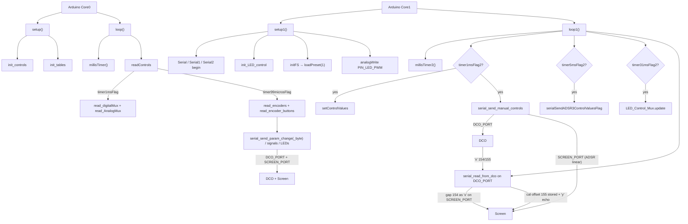

# DCO4_Input_Controller File Index

Purpose of **every file**, and for each source function: **what it does**, **who calls it**, and **when**.

- Deep narrative: [`REFERENCE_AI.md`](REFERENCE_AI.md)
- Panel / pin map: [`PANEL_AND_PINS.md`](PANEL_AND_PINS.md)
- Preset bank / LittleFS: [`PRESETS.md`](PRESETS.md)
- Control scan → serial path: [`CONTROL_PIPELINE.md`](CONTROL_PIPELINE.md)
- Serial / ParamId how-to: [`README_serial_and_params.md`](README_serial_and_params.md)
- Three-board topology: [`SYSTEM_OVERVIEW.md`](SYSTEM_OVERVIEW.md) (stub → DCO4_DCO canonical)
- Repo entry / doc index: [`../README.md`](../README.md)

Headers with no bodies are marked **no function definitions**.  
**Dead** = no live callers. **Unreachable** = call site exists but cannot run as currently gated. **`#ifdef` gated** = compiled only when the flag is set. **commented-out** = body fully commented (not compiled).

MCU: **RP2040** (dual Arduino cores). Panel brain: mux faders/pots, encoders, buttons, 74HC595 LEDs, LittleFS presets; `DCO_PORT` (= `Serial1`) ↔ DCO, `SCREEN_PORT` (= `Serial2`) → Screen (this board is the serial hub between them).

---

## Call-flow overview

| Context tag | Meaning |
|-------------|---------|
| Framework | Arduino invokes `setup` / `loop` / `setup1` / `loop1` |
| Boot Core0 | Inside `setup()` once |
| Boot Core1 | Inside `setup1()` once |
| Every `loop` / `loop1` | Realtime forever loops |
| Soft timer Core0 | Gated by `millisTimer()` flags (`timer1msFlag`, `timer99microsFlag`, `timer200msFlag`, …) |
| Soft timer Core1 | Gated by `millisTimer2()` flags (`timer1msFlag2`, `timer5msFlag2`, `timer31msFlag2`, …) |
| `DCO_PORT` = `Serial1` (DCO) | TX `'a'`–`'f'` control blocks + `'p'`/`'w'` params on GP0; RX DCO `'x'` (gap 154, cal offset 155) on GP1 |
| `SCREEN_PORT` = `Serial2` (Screen) | TX UI signals / params / linear ADSR + relayed DCO `'x'` gap 154 on GP4; no RX (the Screen never transmits) |
| Param TX | Live path is `serial_send_param_change` / `_byte` from encoders/buttons/presets |
| Manual controls | `*ControlManual` flags → `setControlValues` + `serial_send_manual_controls` |
| `#ifdef` | `ENABLE_SERIAL`, `ENABLE_DCO_LINK`, `ENABLE_SCREEN_LINK` |

---

## 1. Entry / build / globals

### `DCO4_Input_Controller.ino`

Main sketch: dual-core `setup`/`loop`/`setup1`/`loop1`, voice/param globals, UART bring-up on Core1, panel scan on Core0.

**Functions**
- `setup()` — `init_controls()` + `init_tables()`.
  - **Called from:** Arduino framework (Core 0).
  - **When:** Boot Core0 once.
- `setup1()` — USB Serial + `DCO_PORT` (RX1/TX0) + `SCREEN_PORT` (RX5/TX4) @ 2 500 000; `init_LED_control`; `initFS`; `analogWrite(PIN_LED_PWM, 245)`.
  - **Called from:** Arduino framework (Core 1).
  - **When:** Boot Core1 once.
  - Note: `PIN_LED_PWM` is GPIO **5**, so this `analogWrite` takes the pin back from `SCREEN_PORT.setRX(5)`. Harmless: GP5 has no conductor and the Screen never transmits.
- `loop()` — `millisTimer()`; `readControls()`; optional USB debug under `ENABLE_SERIAL` (`println("|")` @ `timer200msFlag`; large dump gated by `if (1 == 2)` → **Unreachable**).
  - **Called from:** Arduino framework (Core 0).
  - **When:** Forever.
- `loop1()` — `millisTimer2()`; @1 ms `setControlValues` + `serial_send_manual_controls(false)`; @5 ms may set `serialSendADSR3ControlValuesFlag`; @31 ms `LED_Control_Mux.update()`; always `serial_read_from_dco()`. `sendSerial()` call is **commented-out**.
  - **Called from:** Arduino framework (Core 1).
  - **When:** Forever.

**Key macros / flags:** `NUM_VOICES` (4), `NUM_OSCILLATORS` (8); Serial enables live in `Serial.h`.

### `include_all.h`

Umbrella include for `.ino` units that need shared headers (`buttons.ino`, `encoders.ino`). **No function definitions.** TinyUSB include is commented.

### `params.h`

Live synth/UI parameter globals (ADSR, LFO, voice mode, calibration, manual flags, etc.). **No function definitions.**

### `params_def.h`

Canonical `enum ParamId`. **No function definitions.**

### `tusb_config.h`

TinyUSB MIDI device configuration. Sketch does **not** `#include <Adafruit_TinyUSB.h>` (commented) → config is unused by current build. **No function definitions.**

---

## 2. Serial / parameters

### `Serial.h`

`ENABLE_SERIAL` / `ENABLE_DCO_LINK` / `ENABLE_SCREEN_LINK`, the `DCO_PORT` / `SCREEN_PORT` aliases and the wiring comment, finish byte, legacy TX flags (`serial_send_*Flag`, `serialSendADSR3*`), decls for param senders + `serial_read_from_dco`. **No function definitions.**

### `Serial.ino`

Outbound frames on both links; inbound DCO `'x'` parser on `DCO_PORT` (gap 154 relayed to Screen, cal offset 155 stored).

**Functions**
- `sendUint16(uint16_t)` — `'u'` + 2 bytes on `DCO_PORT`.
  - **Called from:** **none (dead)** — only commented site in `encoders.ino`.
- `sendFloat(float)` — `'t'` + 4 bytes on `DCO_PORT`.
  - **Called from:** **none (dead)**.
- `sendOK()` — `'k'` on `DCO_PORT`.
  - **Called from:** **none (dead)**.
- `serial_send_autotune()` — `'a'` + 255 on `DCO_PORT` + flush.
  - **Called from:** **none (dead)**.
- `serial_send_signal(byte)` — `'s'` + signal on `SCREEN_PORT`.
  - **Called from:** `buttons.ino`; `presetStorage.ino` (`loadPreset`); legacy path in `Controls.ino` (`read_encoder_buttons_preset_save`, itself dead).
  - **When:** Preset / button UI; body under `#ifdef ENABLE_SCREEN_LINK`.
- `serial_send_param_change(byte, uint16_t, bool)` — `'p'` frame → `SCREEN_PORT` (if `sendToAll`) and/or `DCO_PORT`.
  - **Called from:** many sites in `encoders.ino`, `buttons.ino`, `presetStorage.ino`.
  - **When:** Encoder/button/preset param TX; `#ifdef ENABLE_SCREEN_LINK` / `ENABLE_DCO_LINK`.
- `serial_send_param_change_byte(byte, byte, bool)` — `'w'` frame → `SCREEN_PORT` and/or `DCO_PORT`.
  - **Called from:** many sites in `encoders.ino`, `buttons.ino`, `presetStorage.ino`.
  - **When:** Encoder/button/preset param TX; gated same.
- `serial_send_preset_name_to_mainboard()` — `'q'` + 8 chars + finish on `DCO_PORT`.
  - **Called from:** **none (dead)**.
- `serial_send_preset_scroll(byte, byte[])` — `'q'` + preset # + 16-char name on `SCREEN_PORT`.
  - **Called from:** `encoders.ino`; `buttons.ino`; `Controls.ino` legacy save path (dead caller).
  - **When:** Preset scroll / save UI; `#ifdef ENABLE_SCREEN_LINK`.
- `serial_send_save_char_select(byte)` — `'c'` + char position on `SCREEN_PORT`.
  - **Called from:** `encoders.ino`; `Controls.ino` legacy save path (dead caller).
  - **When:** Save-name UI; `#ifdef ENABLE_SCREEN_LINK`.
- `serialSendParamByteToScreen(byte, byte)` — `'y'` frame on `SCREEN_PORT`.
  - **Called from:** `input_handle_param32_from_dco`; `encoders.ino` (manual cal); `buttons.ino` (manual cal).
  - **When:** Screen-only UI params / cal offset echo.
- `serial_forward_param32_to_screen(const uint8_t*, uint8_t)` — Rebuild the received PARAM_32 payload as the same 7-byte `'x'` frame and write it to `SCREEN_PORT` (`static`).
  - **Called from:** `input_handle_param32_from_dco` (gap 154 only).
  - **When:** Each inbound gap frame; body under `#ifdef ENABLE_SCREEN_LINK`.
  - Note: TX wait is `while (SCREEN_PORT.availableForWrite() < 1) {}` — on RP2040 hardware UARTs `availableForWrite()` returns only 0 or 1, so waiting for a larger count would block Core1 forever.
- `input_handle_param32_from_dco(...)` — Decode `'x'`; `PARAM_GAP_FROM_DCO` (154) → forward verbatim to Screen; `PARAM_MANUAL_CALIBRATION_OFFSET_FROM_DCO` (155) → unpack `[oscIndex:8 | offset:8]` from the low 16 bits into `manualCalibrationInitAmpCompOffset[oscIndex]`; may echo offset to Screen as `PARAM_MANUAL_CALIBRATION_OFFSET` (`static`).
  - **Called from:** the DCO-link parser via `dcoLinkCommands[]` → `serial_parser_process_byte`.
  - **When:** `DCO_PORT` RX of PARAM32.
- `serial_read_from_dco()` — Timeout + drain `DCO_PORT` into `dcoLinkParser` (non-blocking pump for the DCO link).
  - **Called from:** `loop1()` every iteration.
  - **When:** Every `loop1`; body under `#ifdef ENABLE_DCO_LINK`.

### `Serial2.ino`

Periodic manual-control blocks; legacy flag flusher.

**Functions**
- `serial_send_manual_controls(bool presetLoading)` — When manual flags or preset load: send `'a'`/`'b'` (exp ADSR on `DCO_PORT`, linear on `SCREEN_PORT`), `'c'` ADSR3, `'d'` filter block, `'e'` ADSR1→VCA, `'f'` PW on `DCO_PORT`.
  - **Called from:** `loop1()` when `timer1msFlag2`; `loadPreset()` in `presetStorage.ino`.
  - **When:** Soft timer Core1 ~1 ms; preset load.
- `sendSerial()` — Flag-driven legacy `DCO_PORT` cmds (`'r'`,`'t'`,`'y'`,`'z'`,`'l'`,`'m'`,`'b'`,`'s'`,`'w'`,`'c'`) to the DCO.
  - **Called from:** **none (dead)** — only `// sendSerial();` in `loop1`.
  - Note: flags still **set** from `encoders.ino` (`serial_send_oscSyncModeFlag`), `buttons.ino` (`serial_send_LFO1toDCOWaveChangeFlag`, `serialSendADSR3ToOscSelectFlag`), `loop1` (`serialSendADSR3ControlValuesFlag`) — those TX branches never run until `sendSerial()` is re-enabled. Most params already use `serial_send_param_change(_byte)` instead.
  - Every branch gates on `availableForWrite() >= 1`, not on the frame length: a hardware UART returns 0 or 1, so the old `> 1` / `> 2` / `> 4` gates could never pass and would have dropped every frame once re-enabled. A full FIFO leaves the flag set for the next call.

### `param_router.h`

**Functions**
- `param_router_apply<ValueT>()` — Linear search descriptor table; invoke matching `apply`.
  - **Called from:** **none (dead)** — included from main sketch / `params.h` path but this MCU *sends* params; no inbound `'p'`/`'w'` router table.

### `params.ino`

**Entirely commented-out** former `update_parameters` display-name switch. No active definitions.

| Commented function | Former role |
|--------------------|-------------|
| `update_parameters(byte, uint16_t)` | Map param id → `paramName` string for UI |

### `serial_parser.h`

Generic non-blocking frame parser.

**Functions**
- `serial_parser_reset()` — Clear context to wait-for-cmd.
  - **Called from:** `serial_parser_check_timeout`; `serial_parser_process_byte`.
  - **When:** Timeout or frame complete.
- `serial_parser_find_cmd()` — Lookup command def.
  - **Called from:** `serial_parser_process_byte`.
  - **When:** First byte of frame.
- `serial_parser_check_timeout()` — Drop stale partial frames.
  - **Called from:** `serial_read_from_dco`.
  - **When:** Before draining UART if mid-payload.
- `serial_parser_process_byte()` — State machine; invoke `on_frame` when complete.
  - **Called from:** `serial_read_from_dco`.
  - **When:** Each `DCO_PORT` RX byte.

### `serial_param_protocol.h`

**Functions**
- `decode_i16_be()` — Big-endian int16.
  - **Called from:** `decode_param_p`.
- `decode_i32_le()` — Little-endian int32.
  - **Called from:** `decode_param_x`.
- `decode_param_p()` / `decode_param_w()` — Fill `ParamFrame` for `'p'`/`'w'`.
  - **Called from:** **none (dead)** in this firmware (docs / other boards).
- `decode_param_x()` — Fill `ParamFrame` for `'x'`.
  - **Called from:** `input_handle_param32_from_dco`.
  - **When:** `DCO_PORT` PARAM32 RX.

### `serial_protocol.h`

Shared DCO-link command enums / payload lengths (copied for ParamId overlap); `'x'` PARAM_32 is the one used here.

**Functions**
- `serial_protocol_payload_len(char)` — Map cmd → size.
  - **Called from:** **none (dead)** — tables use constexpr lengths directly.

### `serial_input_protocol.h`

Legacy input→mainboard command enums / sizes (`'a'`–`'f'`,`'p'`,`'w'`,`'q'`). **Not `#include`d by any `.ino`/`.h` in this repo.**

**Functions**
- `input_serial_payload_len(char)` — Map cmd → size.
  - **Called from:** **none (dead)** — header unused.

---

## 3. Panel controls / LEDs / presets

### `Controls.h`

Mux / encoder / button object decls, pin macros, fader/pot array indices, manual-control flags. **No function definitions.**

### `Controls.ino`

Init/scan muxes; map faders/pots → synth params; legacy preset-save UI; unused exp converters.

**Functions**
- `init_controls()` — 12-bit ADC; begin 11 encoders; digital mux SIG inputs; analog mux channel GPIOs.
  - **Called from:** `setup()`.
  - **When:** Boot Core0.
- `readControls()` — Soft-timer mux scan; @99 µs encoders + buttons (legacy preset-save branch commented).
  - **Called from:** `loop()` every iteration.
  - **When:** Every `loop` (inner work soft-timer gated).
- `setControlValues()` — Map `muxAnalogData` → ADSR1/2/3, CUTOFF/RESONANCE/mod depths, ADSR1toVCA, PW when corresponding `*ControlManual` flags are set.
  - **Called from:** `loop1()` when `timer1msFlag2`.
  - **When:** Soft timer Core1 ~1 ms.
- `read_AnalogMux()` — Dual Kalman filter on 16 analog channels → `muxAnalogData`.
  - **Called from:** `readControls()` when `timer1msFlag`.
  - **When:** Soft timer Core0 ~1 ms.
- `read_digitalMux(bool readPots)` — Scan 3×16 digital mux channels; optionally sample analog SIG.
  - **Called from:** `readControls()` every iteration (`readPots=1` on 1 ms, else 0).
  - **When:** Every `loop`.
- `read_encoders_preset_save()` — Legacy char-select encoder for save UI + Screen updates.
  - **Called from:** **none (dead)** — only `// read_encoders_preset_save()` in `readControls`.
- `read_encoder_buttons_preset_save()` — Legacy save-button UI + signals.
  - **Called from:** **none (dead)** — only commented in `readControls`.
- `faderExpConverter(uint16_t)` — Cubic-ish fader curve.
  - **Called from:** **none (dead)**.
- `expConverterFloat(uint16_t, uint16_t)` — Quadratic float curve.
  - **Called from:** **none (dead)** — only commented uses in `formulas.ino`.
- `expConverter(uint16_t, uint16_t)` — Quadratic uint16 curve.
  - **Called from:** **none (dead)** — commented in `formulas.ino`.
- `expConverterReverse(uint16_t, uint16_t)` — Sqrt reverse.
  - **Called from:** **none (dead)**.
- `expConverterFloatReverse(float, uint16_t)` — Sqrt reverse float.
  - **Called from:** **none (dead)**.

### `buttons.h`

Button action/mode enums and `buttons[]` mapping. **No function definitions.**

### `buttons.ino`

Debounce mux buttons; dispatch wave/LFO/preset/manual/calibration actions; serial + LED side effects.

**Functions**
- `read_encoder_buttons()` — Update all buttons; mode machines; large action `switch` (param TX, LEDs, presets, cal).
  - **Called from:** `readControls()` when `timer99microsFlag`.
  - **When:** Soft timer Core0 ~99 µs.
- `handleLatchedButton(int)` — Latch LED blink for buttons 0–6.
  - **Called from:** `read_encoder_buttons`.
  - **When:** Button latch event.
- `handleHeldButton(int)` — Select held action (func alt).
  - **Called from:** `read_encoder_buttons`.
  - **When:** Button held.
- `handleDoublePressedButton(int)` — Select double-press action.
  - **Called from:** `read_encoder_buttons`.
  - **When:** Double press.
- `handlePressedButton(int)` — Select pressed action.
  - **Called from:** `read_encoder_buttons`.
  - **When:** Press.
- `handleReleasedButton(int)` — Unlatch LEDs + released action.
  - **Called from:** `read_encoder_buttons`.
  - **When:** Release.
- `handleUnlatchedButton(int)` — Clear latch LEDs via `set_LED_Status(16, 0)`.
  - **Called from:** `read_encoder_buttons`.
  - **When:** Unlatch.

### `encoders.h`

Encoder action enums and `encoders[]` / calibration/menu action tables. **No function definitions.**

### `encoders.ino`

**Functions**
- `read_encoders()` — Read 11 encoders; apply action tables; `serial_send_param_change(_byte)`, preset scroll/load, manual-cal offsets, menu position.
  - **Called from:** `readControls()` when `timer99microsFlag`.
  - **When:** Soft timer Core0 ~99 µs.

### `LED_control.h`

74HC595 pins (`PIN_DATA` 11, `PIN_LATCH` 12, `PIN_CLK` 13), `PIN_LED_PWM` **6**, LED pin remap / state arrays. **No function definitions.**

### `LED_control.ino`

**Functions**
- `init_LED_control()` — GPIO + `LED_Control_Mux.begin` / brightness / allOff.
  - **Called from:** `setup1()`.
  - **When:** Boot Core1.
- `set_LED_Status(byte, byte)` — Rebuild all LEDState from globals (arg 16) or set one; call `update_LED_Control`.
  - **Called from:** `buttons.ino`; `presetStorage.ino` (`loadPreset`); `handleReleasedButton` / `handleUnlatchedButton`.
  - **When:** Button / preset UI.
- `update_LED_Control(byte, byte)` — Write 595 pins for one LED or all (arg 16).
  - **Called from:** `set_LED_Status`; `handleLatchedButton`.
  - **When:** LED state change. (Mux shift clocked by `LED_Control_Mux.update()` in `loop1` @ `timer31msFlag2`.)

### `FS.h`

LittleFS preset bank sizes (`NUM_PRESETS` 256, `flashPresetSize` 180, legacy 140) + format version + buffers. **No function definitions.** See [`PRESETS.md`](PRESETS.md).

### `presetStorage.ino`

Load/save presets from LittleFS; push full param set over serial (incl. mod matrix, dist, filter mode, soft sync, sub-osc, porta mode).

**Functions**
- `initFS()` — Mount LittleFS; migrate 256×140 → 256×180 if needed; load bank into RAM; `loadPreset(1)`.
  - **Called from:** `setup1()`.
  - **When:** Boot Core1.
- `load_preset_name(byte)` — Copy 12 name bytes from bank into `loadedName`.
  - **Called from:** **none (dead)**.
- `loadPreset(uint16_t)` — Unpack slot into globals (v1 tail when `flashData[2] >= 1`); TX all params + `serial_send_manual_controls(true)`; refresh LEDs.
  - **Called from:** `initFS`; `encoders.ino` (preset select confirm).
  - **When:** Boot; encoder load.
- `dumpPresetBankToSerial()` — USB dump of entire bank.
  - **Called from:** **none (dead)**; body under `#ifdef ENABLE_SERIAL`.
- `get_preset_name(byte, byte(&)[16])` — Fill 16-char name array for scroll UI.
  - **Called from:** `encoders.ino`.
  - **When:** Preset scroll.
- `writePreset(uint16_t)` — Pack globals (format version 1 + bytes 140..179) + write LittleFS slot.
  - **Called from:** `buttons.ino` (save confirm).
  - **When:** Button save.
- `writePresetActions(uint16_t)` — Clear session manual flags after write.
  - **Called from:** **none (dead)**.
- `loadPresetActions(uint16_t)` — Clear session manual flags after load.
  - **Called from:** **none (dead)**.

---

## 4. Timing / utilities / formulas

### `Timers_millis.h`

Dual soft-timer timestamps + flags (Core0 `timer*Flag`, Core1 `timer*Flag2`). **No function definitions.**

### `Timers_millis.ino`

**Functions**
- `millisTimer()` — Clear then set Core0 soft flags (50 µs … 200 ms).
  - **Called from:** `loop()` every iteration.
  - **When:** Every `loop`.
- `millisTimer2()` — Same for Core1 flag set.
  - **Called from:** `loop1()` every iteration.
  - **When:** Every `loop1`.

### `auxiliary.h`

Kalman filter bank, `linToExpLookup[4096]`, inline math helpers.

**Functions** (inline in header)
- `mapFloat(...)` — Float map.
  - **Called from:** **none (dead)**.
- `linearToExponential(...)` — Lin→exp for the ADSR values sent to the DCO.
  - **Called from:** `init_tables()`.
  - **When:** Boot Core0.

### `auxiliary.ino`

**Functions**
- `init_tables()` — Fill `linToExpLookup[]` via `linearToExponential(i, 50, maxADSRControlValue)`.
  - **Called from:** `setup()`.
  - **When:** Boot Core0.

### `formulas.h`

**Entirely commented-out** former formula float globals. No active definitions.

### `formulas.ino`

**Entirely commented-out** former `formula_update` / `controls_formula_update`. No active definitions.

| Commented function | Former role |
|--------------------|-------------|
| `formula_update(byte)` | Derived float scalars (keytrack, LFO→VCF, etc.) |
| `controls_formula_update(byte)` | LFO speeds / depths via `expConverter*` |

Commented call sites remain in `encoders.ino` / `presetStorage.ino`.

---

## 5. Documentation

All detailed docs live under `docs/` (this file included). Root `README.md` is the repo entry point.

| File | Status | Purpose |
|------|--------|---------|
| `README.md` (repo root) | Current | Overview / build / doc index. |
| `docs/SYSTEM_OVERVIEW.md` | Current | Stub pointing to DCO4_DCO canonical overview (+ local UART table). |
| `docs/CONTROL_PIPELINE.md` | Current | Mux/encoder/button → params → DCO / Screen path. |
| `docs/PANEL_AND_PINS.md` | Current | Panel mux / encoder / LED / UART pin map. |
| `docs/PRESETS.md` | Current | LittleFS bank layout, load/save. |
| `docs/REFERENCE_AI.md` | Current | Deep semantic map. |
| `docs/FILE_INDEX.md` | Current | This file — files, functions, call sites. |
| `docs/README_serial_and_params.md` | Current | Shared serial / ParamId how-to. |

**GPIO 5 (no conflict):** `PIN_LED_PWM` (`LED_control.h`) is **GPIO 5**, and the `analogWrite` in `setup1()` takes the pin back from `SCREEN_PORT.setRX(5)`. Nothing is lost: GP5 has no conductor and the Screen never transmits. The DCO's `'x'` frames (gap 154, cal offset 155) arrive on `DCO_PORT` RX, **GPIO 1**.

---

## 6. External libraries (not in this repo)

| Library | Used by |
|---------|---------|
| `RoxMux` (74HC595) | `LED_control.*` |
| `RoxMux_fela` (`RoxButton`) | `Controls.h` / `buttons.*` |
| `MD_REncoder_fela` | `Controls.h` / `encoders.*` |
| `CD74HC4067` | `Controls.*` |
| `SimpleKalmanFilter` | `auxiliary.h` / `read_AnalogMux` |
| `LittleFS` | `FS.h` / `presetStorage.ino` |
| TinyUSB / Adafruit TinyUSB | Config present (`tusb_config.h`); sketch include **commented** |

---

## Quick “where do I change X?”

| Goal | Start here |
|------|------------|
| Boot / dual-core split | `DCO4_Input_Controller.ino` (`setup` / `setup1` / `loop` / `loop1`) |
| UART peers, baud, pins | `setup1()` + `Serial.h` `ENABLE_*` |
| DCO TX blocks `'a'`–`'f'` | `Serial2.ino` `serial_send_manual_controls` (writes `DCO_PORT`) |
| Screen signals / scroll / `'y'` | `Serial.ino` (`serial_send_signal`, `serial_send_preset_scroll`, `serialSendParamByteToScreen`) |
| Param `'p'`/`'w'` TX | `serial_send_param_change` / `_byte` from `encoders.ino` / `buttons.ino` / `presetStorage.ino` |
| New ParamId | `params_def.h` + encoder/button/preset TX sites (no local `apply_param_*` table) |
| Fader/pot → ADSR/VCF/VCA/PW | `Controls.ino` `setControlValues` |
| Mux / encoder / button pins | `Controls.h` |
| Button → action map | `buttons.h` `buttons[]` + `buttons.ino` switch |
| Encoder → action map | `encoders.h` `encoders[]` + `encoders.ino` |
| Soft timer rates | `Timers_millis.ino` |
| Panel LEDs / brightness PWM pin | `LED_control.h` / `LED_control.ino` (`PIN_LED_PWM` GPIO 5) |
| ADSR lin→exp for the DCO | `auxiliary.ino` / `linearToExponential` / use in `Serial2.ino` |
| Preset layout / load/save | `presetStorage.ino` + `FS.h` |
| RX DCO `'x'` (gap 154 relay / cal offset 155) | `Serial.ino` `serial_read_from_dco` + `input_handle_param32_from_dco` (+ `serial_forward_param32_to_screen`) |
| Legacy flag-driven DCO TX | Re-enable `sendSerial()` in `loop1` **or** remove stale flag sets |
| Formulas / inbound param router | Currently dead: `formulas.*`, `params.ino`, `param_router.h` |
