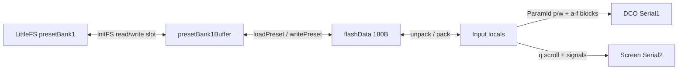
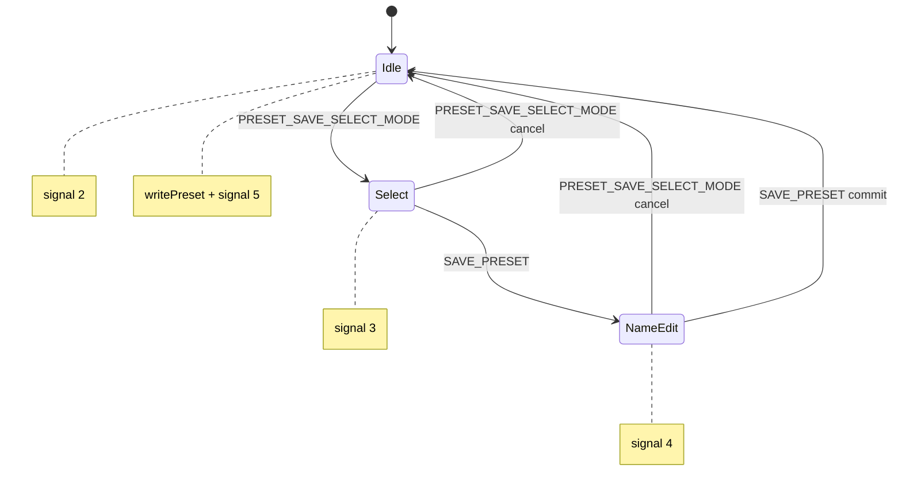

# Input Controller — preset load / save

Preset ownership for DCO4 lives on the **Input Controller**. The DCO and Screen never persist patches; they only receive values when Input loads or when the panel edits live.

Source of truth for packing: [`presetStorage.ino`](../presetStorage.ino) (`loadPreset` / `writePreset`). Constants: [`FS.h`](../FS.h).

---

## Role and memory layers

| Layer | Symbol | Size / role |
|-------|--------|-------------|
| LittleFS file | `"presetBank1"` | Persistent bank on flash |
| RAM bank | `presetBank1Buffer[]` | Full bank in RAM (`NUM_PRESETS × flashPresetSize`) |
| Working slot | `flashData[]` | One 180-byte slot while packing/unpacking |
| Synth locals | `params.h`, `Controls.h`, sketch globals | Live edit state; what save reads |

| Constant | Value |
|----------|-------|
| `NUM_PRESETS` | 256 |
| `flashPresetSize` | **180** |
| `LEGACY_FLASH_PRESET_SIZE` | 140 (format version 0) |
| `PRESET_FORMAT_VERSION` | **1** (written to `flashData[2]` on save) |
| Bank size | 256 × 180 = 46080 bytes |

16-bit fields use Arduino `highByte` / `lowByte` on write and `word(hi, lo)` on read.

---

## Architecture

Related framing for continuous blocks `'a'`–`'d'` + `'p'` 210/222: [`CONTROL_PIPELINE.md`](CONTROL_PIPELINE.md). Mod-slot semantics: [DCO `MOD_MATRIX.md`](../../DCO/docs/MOD_MATRIX.md).

---

## Boot: `initFS()`

Called from `setup1()` on Core 1.

1. `LittleFS.begin()`.
2. **Missing file** — zero RAM bank, write a full 256×180 file.
3. **Legacy file** (`size == 256×140`) — read into the start of `presetBank1Buffer`, expand **backwards** (slot 255 → 0): copy 140 bytes, zero-pad to 180, then rewrite the whole file. Bytes `0..139` of each patch are preserved; `140..179` are zero and treated as format version 0 on load.
4. **Current-sized (or larger) file** — pad up to `flashBankSize` if short, then read the bank into RAM.
5. Copy slot 0 into `flashData`, then **`loadPreset(1)`** (boot always recalls preset index 1, not 0).

---

## Panel UI

Flags in [`Controls.h`](../Controls.h): `presetSaveSelectMode`, `presetSaveMode`, `presetSelectVal`, `currentPreset`, `presetName[]` (loaded name), `presetNameVal[]` (name being edited).

### Browse / load

Encoder action `ACTION_select_preset` ([`encoders.ino`](../encoders.ino)):

- **Normal play** (`!presetSaveSelectMode`): each encoder step updates `presetSelectVal` and immediately calls **`loadPreset(presetSelectVal)`** (no separate confirm).
- **Save-select**: encoder only scrolls; `get_preset_name` + Screen `'q'` (`serial_send_preset_scroll`); does **not** load until the user leaves save mode / loads later in play mode.

### Save state machine

Buttons [`PRESET_SAVE_SELECT_MODE`](../buttons.ino) and [`SAVE_PRESET`](../buttons.ino):

| Mode | Flags | Encoder | Commit |
|------|-------|---------|--------|
| Idle | both false | load on scroll | — |
| Select slot | `presetSaveSelectMode`, `!presetSaveMode` | scroll name only | `SAVE_PRESET` → name edit |
| Name edit | both true | `ACTION_select_char` / `_pos` edits `presetNameVal` | `SAVE_PRESET` → `writePreset(presetSelectVal)` |

Screen signals used by save UI:

| Signal | Meaning |
|--------|---------|
| 3 | Enter save-select |
| 4 | Enter name edit |
| 5 | Preset saved |
| 2 | Save cancelled / exit |
| 6 / 1 | Screen silence during / after `loadPreset` TX |

---

## `loadPreset(n)`

### Unpack

1. Clear **session** manual flags: fader rows, VCF/VCA/PWM pot manual. Do **not** force `ADSR3Enabled` off before unpack.
2. Copy `presetBank1Buffer[n*180 ..]` → `flashData`.
3. Unpack classic region `0..134` into locals (waves, voice, levels, ADSRs, name, …).
4. Call `reset_v1_patch_defaults()` (empty mod matrix `0xFF`/`0xFF`/0, dist 0, soft sync / sub-osc / filter / porta mode 0).
5. If `flashData[2] >= PRESET_FORMAT_VERSION` (1), unpack v1 tail `140..179` over those defaults.
6. Version **0** (including freshly migrated pads): keep the defaults — do **not** treat zero-filled `140..179` as “mod slot 0 = source 0”.

### Re-TX to DCO / Screen

Order (abridged; see code for full list):

1. `serial_send_signal(6)` — screen silence.
2. Force `PARAM_PWM_POTS_CONTROL_MANUAL = 0` (session).
3. TX `PARAM_ADSR3_ENABLED` from unpacked value.
4. Wave enables (OSC1–3 Saw/Pulse/Tri), LED refresh.
5. Restarts, ADSR3→osc, LFO waveforms, intervals, sync, porta time/mode, voice mode, velocity, levels (`sendToAll=true`), unison/drift, hard sync / soft sync / sub-osc, filter mode, dist drive/mix, **all 8 mod slots**.
6. LFO depths, VCA level, keytrack, ADSR3→PWM (**value + 512** on the wire), detunes.
7. `serial_send_manual_controls(true)` — ADSR1/2/3, filter block; ADSR1→VCA / PW as `'p'` 222 / 210. Also explicit `'p'` 210/222 before the manual burst.
8. ADSR curve ParamIds.
9. `serial_send_preset_scroll` + `serial_send_signal(1)`.

Delays between groups pace the serial flood so DCO/Screen keep up.

---

## `writePreset(n)`

1. Clear session manual flags only (`ADSR3Enabled` is **kept** and packed).
2. Pack locals → `flashData` (classic + name from **`presetNameVal`**, not `presetName`).
3. Set `flashData[2] = PRESET_FORMAT_VERSION` (1); pack v1 tail; zero padding `135..139`.
4. Copy `flashData` into `presetBank1Buffer` at `n * 180`.
5. Open LittleFS `"presetBank1"` `r+`, `seek(n*180)`, write 180 bytes, close.
6. Clear save UI flags; set `currentPreset` / `presetSelectVal`; copy first 12 name chars into `presetName`; refresh LEDs.

`writePresetActions` / `loadPresetActions` exist for session cleanup but are **not** called from the live load/save path.

---

## Slot layout (format version 1)

### Flag bytes

| Byte | Bit | Field |
|------|-----|-------|
| 0 | 0 | `waveEnable[0][0]` OSC1 Saw |
| 0 | 1 | `waveEnable[0][1]` OSC1 Pulse |
| 0 | 2 | `waveEnable[0][2]` OSC1 Tri |
| 0 | 3 | unused (legacy sine) — always 0 |
| 0 | 4–5 | unused (legacy SQR enables) — always 0 |
| 0 | 6 | `RESONANCEAmpCompensation` |
| 0 | 7 | `VCAADSRRestart` |
| 1 | 0 | `VCFADSRRestart` |
| 1 | 1 | unused (was PWM pots manual) — always 0 |
| 1 | 2 | `ADSR3Enabled` |
| 1 | 3–7 | unused |
| 2 | — | **format version** (1 on new saves) |
| 3 | 0–2 | OSC2 Saw / Pulse / Tri |
| 3 | 3–5 | OSC3 Saw / Pulse / Tri |
| 3 | 6–7 | unused |
| 4–5 | — | unused |

### Classic scalars (6..134)

| Bytes | Type | Local |
|-------|------|-------|
| 6, 7 | i8 | `LFO1Waveform`, `LFO2Waveform` |
| 8–10 | i8 | `OSC1Interval`, `OSC2Interval`, `oscSyncMode` |
| 11 | u8 | `portamentoTime` (stored as one byte) |
| 12–15 | i8 | `voiceMode`, `ADSR3ToOscSelect`, `velocityToVCF`, `velocityToVCA` |
| 16 | u8 | `unisonDetune` |
| 17–20 | i8 | ADSR1/2 attack/decay curve vals |
| 21–23 | u8 | `analogDrift`, `analogDriftSpeed`, `analogDriftSpread` |
| 24–25 | u8 | `syncMode`, `OSC3Interval` |
| 26–29 | — | unused |
| 30–31 | i16 | `VCFKeytrack` |
| 32–39 | i16 | `OSC1Level`, `OSC2Level`, `SubLevel`, `OSC3Level` |
| 40–49 | i16 | `LFO1toDCO`, `LFO1Speed`, `LFO2Speed`, `ADSR3toPWM`, `ADSR3toDETUNE1` |
| 50–51 | — | reserved |
| 52–55 | i16 | `OSC3Detune`, `LFO2toOSC3DETUNE` |
| 56–61 | — | unused |
| 62–71 | i16 | `OSC2Detune`, `LFO2toOSC2DETUNE`, `VCALevel`, `LFO1toVCA`, `LFO2toPWM` |
| 72–73 | — | unused |
| 74–85 | u16 | `CUTOFF`, `RESONANCE`, `ADSR2toVCF`, `LFO2toVCF`, `ADSR1toVCA`, `PW` |
| 86–87 | — | unused |
| 88–111 | u16 | ADSR1 / ADSR2 / ADSR3 A/D/S/R |
| 112–118 | — | unused |
| 119–134 | char×16 | Preset name (`writePreset` uses `presetNameVal`) |

### Format v1 tail (140..179)

| Bytes | Field | ParamId |
|-------|-------|---------|
| 140 | `filterMode` | `PARAM_FILTER_MODE` (54) |
| 141 | `softSync` | `PARAM_SOFT_SYNC` (36) |
| 142 | `subOscDivide` | `PARAM_SUBOSC_DIVIDE` (37) |
| 143 | `portamentoMode` | `PARAM_PORTAMENTO_MODE` (32) |
| 144–145 | `distDrive` | `PARAM_DIST_DRIVE` (52) |
| 146–147 | `distMix` | `PARAM_DIST_MIX` (53) |
| 148–179 | Mod matrix slots 0..7 | `PARAM_MOD_SLOT0_*` … `PARAM_MOD_SLOT7_*` (60–83) |

Each mod slot is **4 bytes**: `source`, `dest`, `depth` high, `depth` low. Empty = `0xFF` / `0xFF` / `0` (matches DCO `MOD_SRC_EMPTY` / `MOD_DEST_EMPTY`).

Padding **135..139** is unused (zeros).

---

## What is not in a preset

- Session UI: fader-row manual, VCF/VCA/PWM pot manual (PWM manual always TX’d 0 on load).
- Calibration / debug / menu ParamIds (e.g. 101, 120–129, 150+).
- Anything only changed on the DCO via USB `dco_control` / MIDI **without** updating Input locals — save reads Input RAM only. There is no DCO→Input mirror yet; mod/dist/filter panel editors are not wired, so those fields stay at defaults until something sets the Input locals before save.

---

## Extending the format

1. Prefer unused bytes inside 180, or bump `flashPresetSize` and add a migration like the 140→180 path.
2. Bump `PRESET_FORMAT_VERSION` and gate new unpack behind `flashData[2] >= N`.
3. Update **both** `loadPreset` and `writePreset`, plus this doc and Input locals / load TX.
4. Keep ParamId numbers stable across MCU `params_def.h` mirrors.
