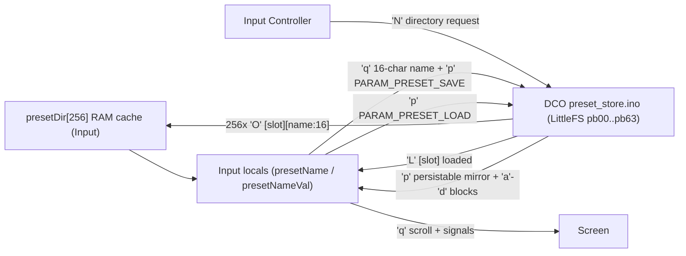
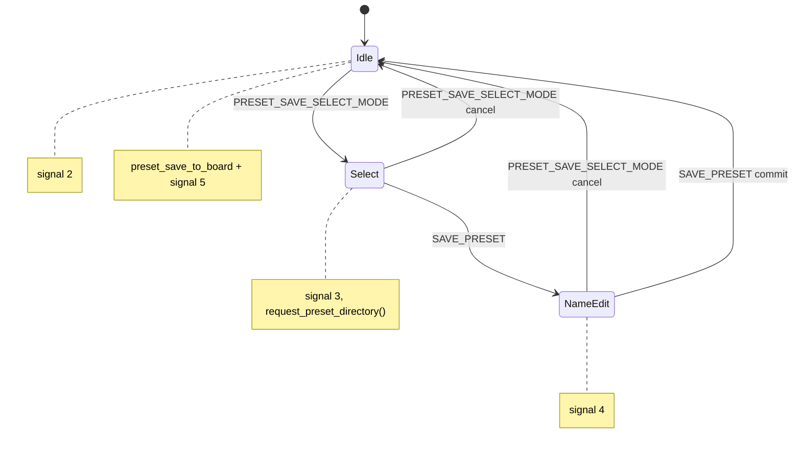

# Input Controller — preset browse / save / load

Preset **storage** ownership moved to the **DCO board**: the DCO's LittleFS
256-slot store (`pb00`..`pb63`, 4 records each) is the single source of truth system-wide.
Input has no LittleFS of its own and never persists a patch — it only keeps a
RAM-only cache of the 256 slot **names** (for the encoder scroll UI) and asks
the DCO to save/load/report slots over the panel link. The Screen never
persists patches either; it only renders what Input tells it to.

This is true of **both instruments**, and this file describes both. The only
difference is how many hops the frames make:

| Model | Path from Input to the preset store |
|-------|-------------------------------------|
| DCO3-MONOSYNTH | Input `DCO_PORT` straight to the DCO |
| DCO4-REBORN | Input `DCO_PORT` to the STM32 Mainboard, which relays `'q'`, `'N'` and ParamIds 170/171 on to the DCO, and relays the DCO's `'O'` and `'L'` answers back |

On DCO4 the relay is explicit, per command byte, in
[`MAINBOARD-CONTROLLER/Serial.ino`](../../MAINBOARD-CONTROLLER/Serial.ino); the
Mainboard has no generic pass-through, so a new preset command byte has to be
registered there as well as on the two endpoints. Nothing in `presetStorage.ino`
is aware of the difference.

DCO4 previously kept its own 256-slot LittleFS bank on this board
(`presetBank1`, 180-byte slots, in the now-deleted `FS.h`). That is gone; the
old bank is **not** migrated, so DCO4 starts from an empty DCO-side store.

Source of truth for the wire protocol and record format: [`DCO/preset_store.h`](../../DCO/preset_store.h) /
[`DCO/preset_store.ino`](../../DCO/preset_store.ino) — deep doc:
[`DCO/docs/PRESET_STORE.md`](../../DCO/docs/PRESET_STORE.md).
Source of truth on this board: [`presetStorage.ino`](../presetStorage.ino).

---

## Role and memory layers

| Layer | Symbol | Size / role |
|-------|--------|-------------|
| DCO LittleFS | `pb00`..`pb63` (on the **DCO**, not Input) | 598-byte records × 4 per chunk; store of record |
| Input RAM cache | `presetDir[256][16]` | Names only, fetched from the DCO; no patch data |
| Name being edited | `presetNameVal[]` (`Controls.h`) | 16 ASCII chars, edited via `ACTION_select_char`/`_pos` |
| Loaded / current name | `presetName[]` (`params.h`) | 16 ASCII chars, mirrors the DCO's current slot name |

Input's addressable range is **0..255** (matches the DCO's 256 slots). There is
no local 180-byte slot format, no `flashPresetSize`/`flashBankSize`, and no
migration code on this board anymore — all of that lived in the now-deleted
`FS.h` and the pre-rewrite `presetStorage.ino`.

---

## Architecture

Related framing for continuous blocks `'a'`–`'d'` + `'p'` 210/222:
[`CONTROL_PIPELINE.md`](CONTROL_PIPELINE.md). Mod-slot semantics:
[DCO `MOD_MATRIX.md`](../../DCO/docs/MOD_MATRIX.md).

---

## Boot: `request_preset_directory()`

Called from `setup1()` on Core 1 (after `DCO_PORT`/`init_dco_link_parser()` are
up), replacing the old `initFS()`. Sends the 1-byte `'N'` frame; the DCO
answers with 256 `'O'` frames that fill `presetDir[]`. Boot-time preset
**recall** is no longer Input's job — the DCO does its own
`preset_store_boot_recall()` independently and announces the result with `'L'`.

`'N'`'s payload is 1 unused/padding byte, not 0: the shared parser
(`serial_parser_dispatch()`) treats `payload_len == 0` as "unregistered
command" in both RAW and COBS framing, so a true zero-length frame could never
dispatch.

---

## Panel UI

Flags in [`Controls.h`](../Controls.h): `presetSaveSelectMode`, `presetSaveMode`,
`presetSelectVal` (0..255), `currentPreset`, `presetNameVal[]` (name being
edited). `presetName[]` (loaded name) lives in [`params.h`](../params.h).

### Browse / load

Encoder action `ACTION_select_preset` ([`encoders.ino`](../encoders.ino)):

- **Normal play** (`!presetSaveSelectMode`): each encoder step updates
  `presetSelectVal` (clamped `0..255`) and immediately calls
  **`preset_load_from_board(presetSelectVal)`** — sends `PARAM_PRESET_LOAD` to
  the DCO, updates the Screen from the local name cache right away, and the
  DCO's own `'L'` notice + persistable `'p'`/`'a'`-`'d'` mirror confirm/apply
  everything else.
- **Save-select**: encoder only scrolls; `get_preset_name()` reads
  `presetDir[]` (no round trip) + Screen `'q'` (`serial_send_preset_scroll`);
  does **not** load until the user leaves save mode / loads later in play mode.

### Save state machine

Buttons [`PRESET_SAVE_SELECT_MODE`](../buttons.ino) and
[`SAVE_PRESET`](../buttons.ino):

| Mode | Flags | Encoder | Commit |
|------|-------|---------|--------|
| Idle | both false | load on scroll | — |
| Select slot | `presetSaveSelectMode`, `!presetSaveMode` | scroll name only (cache) | `SAVE_PRESET` → name edit |
| Name edit | both true | `ACTION_select_char` / `_pos` edits `presetNameVal` | `SAVE_PRESET` → `preset_save_to_board(presetSelectVal)` |

Entering select mode also calls `request_preset_directory()` to refresh the
cache, guarding against staleness if another peer (e.g. `dco_control`)
renamed/saved a slot on the DCO since boot.

Screen signals used by save UI:

| Signal | Meaning |
|--------|---------|
| 3 | Enter save-select |
| 4 | Enter name edit |
| 5 | Preset saved |
| 2 | Save cancelled / exit |
| 6 / 1 | Screen silence during / after a preset-scroll TX |

---

## `preset_load_from_board(slot)`

Replaces the old `loadPreset(n)`. There is no local unpack step anymore — the
DCO owns the record and applies it itself:

1. Clear **session** manual flags: fader rows, VCF/VCA/PWM pot manual.
2. Send `PARAM_PRESET_LOAD` (171) = slot to the DCO (`serial_send_param_change_byte`, DCO-only).
3. Update `currentPreset` / `presetSelectVal` / `presetName[]` from the local
   `presetDir[slot]` cache (optimistic — no round trip needed for the Screen).
4. `serial_send_preset_scroll()` + `serial_send_signal(1)` (same Screen update
   the old `loadPreset()` sent at the end).

The DCO then applies the record (`preset_record_apply()`) and mirrors every
captured persistable `'p'` id plus all four `'a'`–`'d'` blocks back over the
existing panel link — Input's existing `input_handle_param16_from_dco()` /
persistable-mirror handling picks those up with **zero changes**, exactly as it
already did for USB/MIDI-triggered loads. The DCO also fires `'L'` `[slot]`
once the load completes, so a load triggered by boot recall / MIDI Program
Change / USB `dco_control` also updates Input's Screen display, not just
Input-triggered loads.

Of the four block frames, only `'d'` (filter) is parsed by Input's
`dcoLinkCommands[]` LUT, via `input_handle_filter_block_from_dco()`: it refreshes
Input's `CUTOFF` / `RESONANCE` / `ADSR2toVCF` / `LFO2toVCF` locals so the pots
resume from the recalled values, and passes the frame on to the Screen. The
three ADSR blocks `'a'`–`'c'` are still ignored here; Input's ADSR locals come
only from its own faders. Note that the Screen does not register `'d'` either,
so the forwarded frame is dropped at that end until a handler is added there.

---

## `preset_save_to_board(slot)`

Replaces the old `writePreset(n)`. The DCO builds and writes the whole record
(shadow-captured params + block globals) itself — Input only needs to tell it
the name and the target slot:

1. Clear session manual flags (same as before).
2. `serial_send_preset_name_to_mainboard()` — 16-byte `'q'` frame from `presetNameVal`.
3. Send `PARAM_PRESET_SAVE` (170) = slot (DCO-only).
4. Update `presetDir[slot]` from `presetNameVal` locally (no re-fetch needed).
5. Update `currentPreset` / `presetSelectVal` / `presetName[]`; refresh LEDs.

`writePresetActions` / `loadPresetActions` still exist for session cleanup but
are **not** called from the live load/save path (same as before the rewrite).

---

## What is not cached on Input

Only the **name** of each of the 256 slots lives in Input's RAM
(`presetDir[256][16]`). Every other patch parameter, the four `'a'`–`'d'`
blocks, and the calibration tables live exclusively in the DCO's LittleFS —
see [`DCO/docs/PRESET_STORE.md`](../../DCO/docs/PRESET_STORE.md) for the
598-byte record layout and everything that is/isn't captured in a preset.

---

## Extending the format

The 598-byte record format is owned entirely by the DCO now
(`DCO/preset_store.h`) — extend it there, not here. On this board, only touch
`presetStorage.ino` if the **directory/notification protocol** itself
(`'N'`/`'O'`/`'L'`, or the 16-byte `'q'` name width) needs to change; keep
`INPUT_SERIAL_LEN_PRESET_NAME` / `INPUT_SERIAL_LEN_PRESET_DIR_ENTRY` in sync
with `DCO/serial_input_protocol.h` if so.
